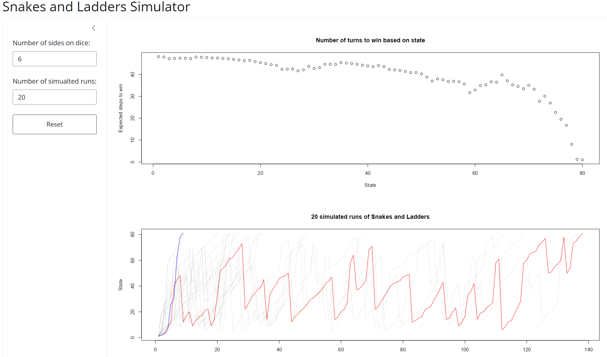

# markov-slithers

Analysing Snakes and Ladders as a discrete-time Markov chain. Full analysis can be found in `snakes and ladders.qmd` with HTML and Markdown formats available. Use `snakes and ladders.md` if viewing on GitHub.

## Shiny App

Interactive Shiny app where you can explore how expected turns to win changes by the number of sides on a dice. 
Bonus visualisation of simulated runs (red indicates longest run, blue indicates shortest run). Currently limited to a single board layout. Check it out [here](https://019d2c72-0773-0e32-05c1-52952e153015.share.connect.posit.cloud/).

Possible future features:

 - Changeable board size
 - Ability to generate/input snakes and ladders
