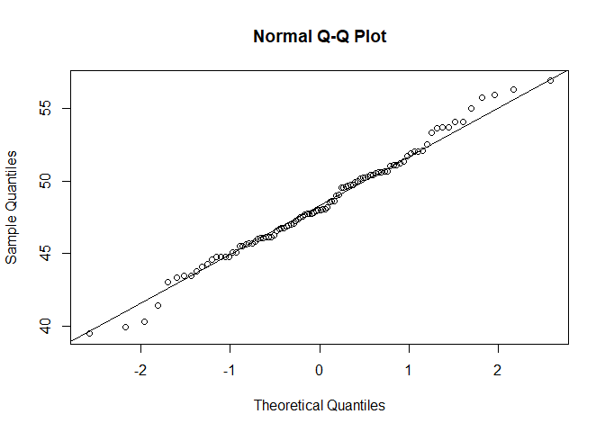
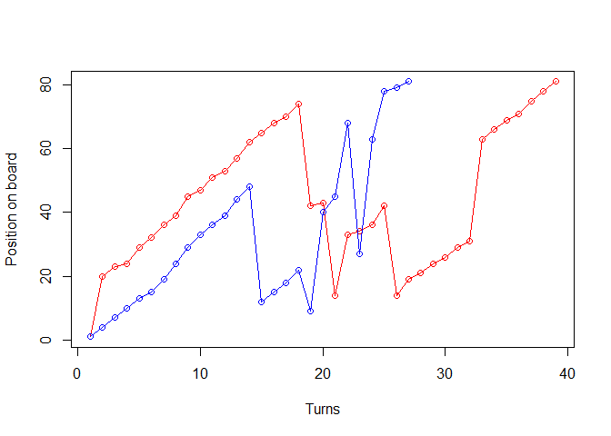
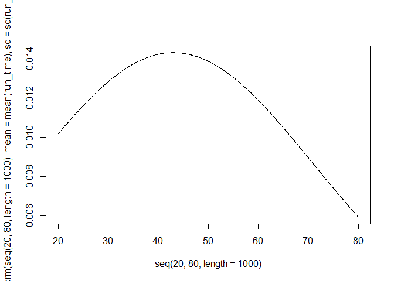
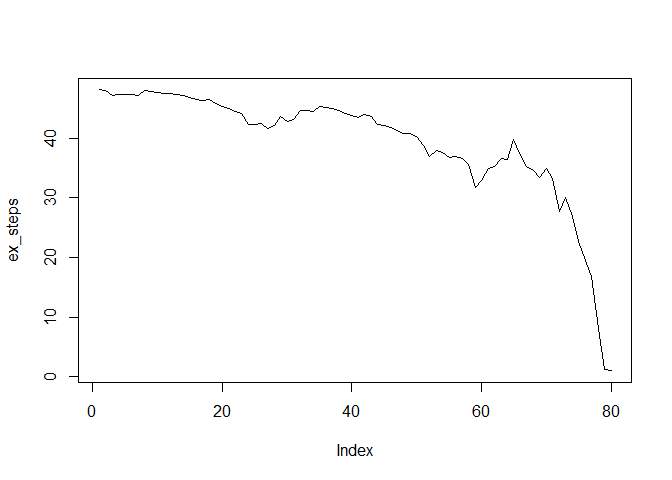
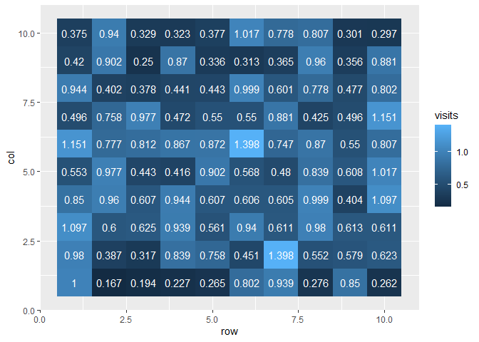
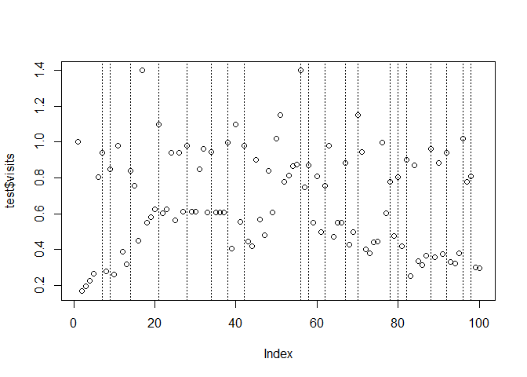
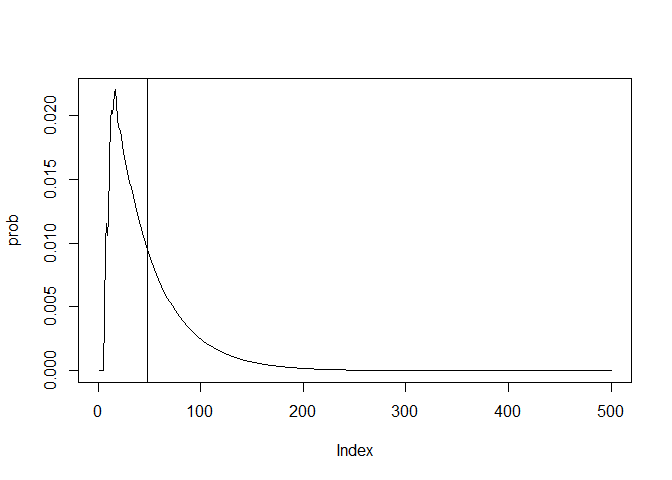

# Markov chains: Snakes and Ladders


## Introduction

The classic Snakes and Ladders board game can be represented by an $n$
by $n$ Markov Chain

## Running Code

When you click the **Render** button a document will be generated that
includes both content and the output of embedded code. You can embed
code like this:

``` r
# size of board
n = 100

# number of sides of dice
d = 6

ladders = list(c(6,23),c(8,30),c(13,47),c(20,39),c(33,70),
               c(37,75),c(41,62),c(57,83),c(66,89),c(77,96))

snakes = list(c(27,10),c(55,16),c(61,14),c(69,50),c(79,5),
              c(81,44),c(87,31),c(91,25),c(95,49),c(97,59))

#ladders = list()
#snakes = list()

board = matrix(0,n,n)

# create simple board with no ladders
for (i in 1:n) {
  for (j in 0:min(n-i,d-1)) {
    board[i,j+i] = 1/d 
  } 
}

board = board %>%  
  cbind(rep(0,n), .) %>% 
  rbind(c(rep(0,n),1))

#if n < d: start from 1+(d-n)
#else start from 1
board[,n+1][max(1,(n-(d-1))):n] = (max(1,1+d-n):d)/d

rownames(board) = 0:(n)
colnames(board) = 0:(n)

delete = c()

# add in ladders
for (i in ladders) {
  for (j in (i[1]-(d-1)):i[1]) {
    board[j,][i[2]+1] = board[j,][i[2]+1] + 1/d
  }
  delete = c(delete, i[1])
}

# add in snakes
for (i in snakes) {
  for (j in (i[1]-(d-1)):i[1]) {
    board[j,][i[2]+1] = board[j,][i[2]+1] + 1/d
  }
  delete = c(delete, i[1])
}

delete = delete+1

board = board[-(delete),-(delete)]
```

You can add options to executable code like this

``` r
# simulate discrete Markov chains according to transition matrix P
simulatemc = function(tm) {
  
  # vector of states over time t
  states = c()

  # initialise variable for first state 
  states[1] = 1
  
  t = 1
  while (states[t] != nrow(tm)) {
    t = t + 1
    # probability vector to simulate next state X_{t+1}
    p = tm[states[t-1], ]
    
    # draw from multinomial and determine state
    states[t] <-  which(rmultinom(1, 1, p) == 1)
  }
  return(states)
}
```

The `echo: false` option disables the printing of code (only output is
displayed).

``` r
avg = c()
#lln = c()
for (j in 1:100) {
  run_time = c()
  for (i in 1:100) {
    run_time = c(run_time, length(simulatemc(board))-1)
    #lln = c(lln, mean(run_time))
  }
  avg = c(avg, mean(run_time))
}

difference = c()
for (i in snakes) {
  difference = c(difference, i[1]-i[2])
}
difference
```

     [1] 17 39 47 19 74 37 56 66 46 38

``` r
difference = c()
for (i in ladders) {
  difference = c(difference, i[2]-i[1])
}
difference
```

     [1] 17 22 34 19 37 38 21 26 23 19

``` r
qqnorm(avg) 
qqline(avg)
```



``` r
t.test(avg, mu=47.98, alternative="two.sided")
```


        One Sample t-test

    data:  avg
    t = 1.0478, df = 99, p-value = 0.2973
    alternative hypothesis: true mean is not equal to 47.98
    95 percent confidence interval:
     47.64639 49.06021
    sample estimates:
    mean of x 
      48.3533 

``` r
mean(run_time)
```

    [1] 43.03

``` r
sd(run_time)
```

    [1] 27.86129

``` r
player1 = simulatemc(board)
player2 = simulatemc(board)
plot(player1, type='o', col='red', ylab="Position on board", xlab="Turns")
lines(player2, type='o', col='blue')
```



``` r
player1
```

     [1]  1 20 23 24 29 32 36 39 45 47 51 53 57 62 65 68 70 74 42 43 14 33 34 36 42
    [26] 14 19 21 24 26 29 31 63 66 69 71 75 78 81

``` r
player2
```

     [1]  1  4  7 10 13 15 19 24 29 33 36 39 44 48 12 15 18 22  9 40 45 68 27 63 78
    [26] 79 81

``` r
#plot(lln, type='l', ylim = c(45,55))
#hist(run_time, breaks=50)

plot(seq(20, 80, length=1000), dnorm(seq(20, 80, length=1000), mean=mean(run_time), sd=sd(run_time)), type="l", lwd=1)
```



``` r
# expected number of visits from transient state i to transient state j
fundamental = solve(diag(nrow(board)-1) - board[1:(nrow(board)-1),1:(nrow(board)-1)])

ex_steps = fundamental %*% matrix(1,nrow(board)-1,1) # expected number of steps to absorbing state from state i
fundamental[1,] #expected number of visits to state i from the starting position
```

            0         1         2         3         4         5         7         9 
    1.0000000 0.1666667 0.1944444 0.2268519 0.2646605 0.8022688 0.2758154 0.2615994 
           10        11        12        14        15        16        17        18 
    0.9801697 0.3866422 0.3173711 0.7575719 0.4505590 1.3981278 0.5517120 0.5792236 
           19        21        22        23        24        25        26        28 
    0.6228657 0.6004147 0.6253906 0.9390831 0.5611630 0.9396691 0.6109534 0.6127099 
           29        30        31        32        34        35        36        38 
    0.6105964 0.8498555 0.9595827 0.6072830 0.6066712 0.6056648 0.6048429 0.4040770 
           39        40        42        43        44        45        46        47 
    1.0968860 0.5530236 0.4431382 0.4161875 0.9016898 0.5684875 0.4804211 0.8385870 
           48        49        50        51        52        53        54        56 
    0.6080852 1.0166197 1.1512042 0.7772341 0.8120252 0.8672926 0.8720768 0.7466388 
           58        59        60        62        63        64        65        67 
    0.5496722 0.8073769 0.4959608 0.9773572 0.4717279 0.5503492 0.5504620 0.4249827 
           68        70        71        72        73        74        75        76 
    0.4958131 0.9436057 0.4024773 0.3778131 0.4407820 0.4434152 0.9986896 0.6011305 
           78        80        82        83        84        85        86        88 
    0.4769717 0.4200345 0.2496895 0.8703272 0.3361705 0.3127036 0.3648209 0.3556186 
           89        90        92        93        94        96        98        99 
    0.8809163 0.3750383 0.3293990 0.3234954 0.3774113 0.7782753 0.3014302 0.2967687 

``` r
(fundamental-diag(nrow(board)-1)) %*% solve(diag(diag(fundamental),nrow(board)-1,nrow(board)-1))
```

       [,1]      [,2]      [,3]      [,4]      [,5]       [,6]       [,7]
    0     0 0.1666667 0.1944444 0.2268519 0.2646605 0.53883811 0.25537127
    1     0 0.0000000 0.1666667 0.1944444 0.2268519 0.50794922 0.36174680
    2     0 0.0000000 0.0000000 0.1666667 0.1944444 0.48407463 0.32125533
    3     0 0.0000000 0.0000000 0.0000000 0.1666667 0.46082931 0.28590933
    4     0 0.0000000 0.0000000 0.0000000 0.0000000 0.44107112 0.25565097
    5     0 0.0000000 0.0000000 0.0000000 0.0000000 0.32835711 0.22975443
    7     0 0.0000000 0.0000000 0.0000000 0.0000000 0.32261587 0.07412242
    9     0 0.0000000 0.0000000 0.0000000 0.0000000 0.32135738 0.07383328
    10    0 0.0000000 0.0000000 0.0000000 0.0000000 0.32252194 0.07410084
    11    0 0.0000000 0.0000000 0.0000000 0.0000000 0.32371596 0.07437517
    12    0 0.0000000 0.0000000 0.0000000 0.0000000 0.32491226 0.07465003
    14    0 0.0000000 0.0000000 0.0000000 0.0000000 0.32658718 0.07503485
    15    0 0.0000000 0.0000000 0.0000000 0.0000000 0.32804640 0.07537011
    16    0 0.0000000 0.0000000 0.0000000 0.0000000 0.32950932 0.07570622
    17    0 0.0000000 0.0000000 0.0000000 0.0000000 0.33088004 0.07602115
    18    0 0.0000000 0.0000000 0.0000000 0.0000000 0.33209010 0.07629917
    19    0 0.0000000 0.0000000 0.0000000 0.0000000 0.33331272 0.07658007
    21    0 0.0000000 0.0000000 0.0000000 0.0000000 0.33680176 0.07738170
    22    0 0.0000000 0.0000000 0.0000000 0.0000000 0.33828679 0.07772289
    23    0 0.0000000 0.0000000 0.0000000 0.0000000 0.33910437 0.07791073
    24    0 0.0000000 0.0000000 0.0000000 0.0000000 0.33935048 0.07796728
    25    0 0.0000000 0.0000000 0.0000000 0.0000000 0.34064842 0.07826548
    26    0 0.0000000 0.0000000 0.0000000 0.0000000 0.34089853 0.07832295
    28    0 0.0000000 0.0000000 0.0000000 0.0000000 0.34719698 0.07977004
    29    0 0.0000000 0.0000000 0.0000000 0.0000000 0.34400988 0.07903779
    30    0 0.0000000 0.0000000 0.0000000 0.0000000 0.34082714 0.07830654
    31    0 0.0000000 0.0000000 0.0000000 0.0000000 0.34843606 0.08005473
    32    0 0.0000000 0.0000000 0.0000000 0.0000000 0.34239919 0.07866773
    34    0 0.0000000 0.0000000 0.0000000 0.0000000 0.32629577 0.07496790
    35    0 0.0000000 0.0000000 0.0000000 0.0000000 0.32488733 0.07464430
    36    0 0.0000000 0.0000000 0.0000000 0.0000000 0.32173064 0.07391904
    38    0 0.0000000 0.0000000 0.0000000 0.0000000 0.30617802 0.07034576
    39    0 0.0000000 0.0000000 0.0000000 0.0000000 0.30568449 0.07023237
    40    0 0.0000000 0.0000000 0.0000000 0.0000000 0.30520459 0.07012211
    42    0 0.0000000 0.0000000 0.0000000 0.0000000 0.30279054 0.06956747
    43    0 0.0000000 0.0000000 0.0000000 0.0000000 0.30328583 0.06968126
    44    0 0.0000000 0.0000000 0.0000000 0.0000000 0.30366603 0.06976862
    45    0 0.0000000 0.0000000 0.0000000 0.0000000 0.30272331 0.06955202
    46    0 0.0000000 0.0000000 0.0000000 0.0000000 0.30232517 0.06946055
    47    0 0.0000000 0.0000000 0.0000000 0.0000000 0.30236054 0.06946867
    48    0 0.0000000 0.0000000 0.0000000 0.0000000 0.30238234 0.06947368
    49    0 0.0000000 0.0000000 0.0000000 0.0000000 0.30625762 0.07036405
    50    0 0.0000000 0.0000000 0.0000000 0.0000000 0.30594722 0.07029273
    51    0 0.0000000 0.0000000 0.0000000 0.0000000 0.29706695 0.06825245
    52    0 0.0000000 0.0000000 0.0000000 0.0000000 0.29993632 0.06891170
    53    0 0.0000000 0.0000000 0.0000000 0.0000000 0.30257276 0.06951743
    54    0 0.0000000 0.0000000 0.0000000 0.0000000 0.30251319 0.06950374
    56    0 0.0000000 0.0000000 0.0000000 0.0000000 0.30408480 0.06986483
    58    0 0.0000000 0.0000000 0.0000000 0.0000000 0.31715254 0.07286720
    59    0 0.0000000 0.0000000 0.0000000 0.0000000 0.31839140 0.07315184
    60    0 0.0000000 0.0000000 0.0000000 0.0000000 0.30215574 0.06942162
    62    0 0.0000000 0.0000000 0.0000000 0.0000000 0.31643665 0.07270272
    63    0 0.0000000 0.0000000 0.0000000 0.0000000 0.31493816 0.07235844
    64    0 0.0000000 0.0000000 0.0000000 0.0000000 0.32440611 0.07453374
    65    0 0.0000000 0.0000000 0.0000000 0.0000000 0.32582459 0.07485964
    67    0 0.0000000 0.0000000 0.0000000 0.0000000 0.36090805 0.08292022
    68    0 0.0000000 0.0000000 0.0000000 0.0000000 0.36780121 0.08450396
    70    0 0.0000000 0.0000000 0.0000000 0.0000000 0.38121382 0.08758556
    71    0 0.0000000 0.0000000 0.0000000 0.0000000 0.33433545 0.07681505
    72    0 0.0000000 0.0000000 0.0000000 0.0000000 0.34100417 0.07834722
    73    0 0.0000000 0.0000000 0.0000000 0.0000000 0.43514643 0.09997682
    74    0 0.0000000 0.0000000 0.0000000 0.0000000 0.40916016 0.09400636
    75    0 0.0000000 0.0000000 0.0000000 0.0000000 0.39408957 0.09054383
    76    0 0.0000000 0.0000000 0.0000000 0.0000000 0.37354714 0.08582411
    78    0 0.0000000 0.0000000 0.0000000 0.0000000 0.38101645 0.08754022
    80    0 0.0000000 0.0000000 0.0000000 0.0000000 0.25324258 0.05818360
    82    0 0.0000000 0.0000000 0.0000000 0.0000000 0.25029257 0.05750583
    83    0 0.0000000 0.0000000 0.0000000 0.0000000 0.24378531 0.05601075
    84    0 0.0000000 0.0000000 0.0000000 0.0000000 0.23511222 0.05401807
    85    0 0.0000000 0.0000000 0.0000000 0.0000000 0.25018882 0.05748199
    86    0 0.0000000 0.0000000 0.0000000 0.0000000 0.23641052 0.05431636
    88    0 0.0000000 0.0000000 0.0000000 0.0000000 0.18782246 0.04315304
    89    0 0.0000000 0.0000000 0.0000000 0.0000000 0.20474177 0.04704033
    90    0 0.0000000 0.0000000 0.0000000 0.0000000 0.18307369 0.04206199
    92    0 0.0000000 0.0000000 0.0000000 0.0000000 0.15374074 0.03532261
    93    0 0.0000000 0.0000000 0.0000000 0.0000000 0.13177777 0.03027653
    94    0 0.0000000 0.0000000 0.0000000 0.0000000 0.11295238 0.02595131
    96    0 0.0000000 0.0000000 0.0000000 0.0000000 0.05306523 0.01219197
    98    0 0.0000000 0.0000000 0.0000000 0.0000000 0.00000000 0.00000000
    99    0 0.0000000 0.0000000 0.0000000 0.0000000 0.00000000 0.00000000
             [,8]       [,9]      [,10]      [,11]      [,12]      [,13]      [,14]
    0  0.23933311 0.53301813 0.30911833 0.26142471 0.45173681 0.33198407 0.60070391
    1  0.23913267 0.53239757 0.31811814 0.27855646 0.45655067 0.33674491 0.60669374
    2  0.21786698 0.50420831 0.29754966 0.25871286 0.44190484 0.31839056 0.59236788
    3  0.32960027 0.50947238 0.30541445 0.27291790 0.45968670 0.34156515 0.60256215
    4  0.29471802 0.57954776 0.30923017 0.28154312 0.47166804 0.35704725 0.61816278
    5  0.26486412 0.56268875 0.40791157 0.28591248 0.47912826 0.36657831 0.62860640
    7  0.23793003 0.52867421 0.37211703 0.38134692 0.48543385 0.36530995 0.64263269
    9  0.08511604 0.54105683 0.35260316 0.35814816 0.56637784 0.48061269 0.66372772
    10 0.08542449 0.45619810 0.33212449 0.33329442 0.54355609 0.44993985 0.71176662
    11 0.08574074 0.46153470 0.20050547 0.31212863 0.52388962 0.42376467 0.69126807
    12 0.08605760 0.46593095 0.20190573 0.17628069 0.50680434 0.40124350 0.67329981
    14 0.08650123 0.46763579 0.20277576 0.17698412 0.40370435 0.38069355 0.65387018
    15 0.08688772 0.48278950 0.20688295 0.18162276 0.40607162 0.26317299 0.64284049
    16 0.08727519 0.49084762 0.20925249 0.18417196 0.40662558 0.26590283 0.57035120
    17 0.08763825 0.49355425 0.21028584 0.18513388 0.40589083 0.26671361 0.56827682
    18 0.08795875 0.49230847 0.21030735 0.18491239 0.40429262 0.26611644 0.56549025
    19 0.08828258 0.48815701 0.20962025 0.18383659 0.40200528 0.26448541 0.56206977
    21 0.08920670 0.57371179 0.23152611 0.20945462 0.42027525 0.29487662 0.57666240
    22 0.08960003 0.53919634 0.22346971 0.19946715 0.40994932 0.28228189 0.56506425
    23 0.08981658 0.50979400 0.21648596 0.19090545 0.40148234 0.27157826 0.55583052
    24 0.08988177 0.48483382 0.21043637 0.18358343 0.39470341 0.26253343 0.54877084
    25 0.09022554 0.46324827 0.20549770 0.17738176 0.38828121 0.25469921 0.54154691
    26 0.09029179 0.44519828 0.20114240 0.17209550 0.38367911 0.24822707 0.53699529
    28 0.09196002 0.33210367 0.17513136 0.13954235 0.34799374 0.20671350 0.49547529
    29 0.09111588 0.33337997 0.17458347 0.13953523 0.35068046 0.20735652 0.50042817
    30 0.09027288 0.33507274 0.17413880 0.13965130 0.35402985 0.20826443 0.50641276
    31 0.09228821 0.33373499 0.17586568 0.14017175 0.34974801 0.20769386 0.49820334
    32 0.09068926 0.33689833 0.17501064 0.14037793 0.35606653 0.20939427 0.50968557
    34 0.08642404 0.34765004 0.17329667 0.14160932 0.37608396 0.21529259 0.54558294
    35 0.08605100 0.34103776 0.17129612 0.13949252 0.36680077 0.21121458 0.53014541
    36 0.08521490 0.34522937 0.17147079 0.14034771 0.37412616 0.21371188 0.54232031
    38 0.08109557 0.35587838 0.16988039 0.14161505 0.39397760 0.21959674 0.57857893
    39 0.08096485 0.35815786 0.17030567 0.14222712 0.39734016 0.22094304 0.58454372
    40 0.08083774 0.35988837 0.17060011 0.14267914 0.40020206 0.22201878 0.58896247
    42 0.08019835 0.37037902 0.17251878 0.14547885 0.41807849 0.22869570 0.61536969
    43 0.08032954 0.37233037 0.17313068 0.14611312 0.41789554 0.22930484 0.62158367
    44 0.08043024 0.37315057 0.17343432 0.14640038 0.41924770 0.22987152 0.62349379
    45 0.08018054 0.37183477 0.17285734 0.14589954 0.41751555 0.22902084 0.62033244
    46 0.08007509 0.37027145 0.17236676 0.14539124 0.41737349 0.22847326 0.61547501
    47 0.08008446 0.36845007 0.17193001 0.14485904 0.41794537 0.22803455 0.60932115
    48 0.08009023 0.36623692 0.17139361 0.14420981 0.41849326 0.22746919 0.60201209
    49 0.08111666 0.38403845 0.17680202 0.14991869 0.41679788 0.23295971 0.65886751
    50 0.08103444 0.37807173 0.17525616 0.14812399 0.42736063 0.23327158 0.63495454
    51 0.07868238 0.36394002 0.16939545 0.14289448 0.40712267 0.22391677 0.60136435
    52 0.07944237 0.36089153 0.16942330 0.14234145 0.41652111 0.22518775 0.58633045
    53 0.08014067 0.35752178 0.16930954 0.14166580 0.42137668 0.22540229 0.57239794
    54 0.08012489 0.35295799 0.16817517 0.14031445 0.42178062 0.22407703 0.55815776
    56 0.08054115 0.34227145 0.16598101 0.13735579 0.49073711 0.23514278 0.49147671
    58 0.08400233 0.34260058 0.16959040 0.13902324 0.47291181 0.23281366 0.49612703
    59 0.08433046 0.33730327 0.16862693 0.13761189 0.45051009 0.22668949 0.48880288
    60 0.08003021 0.32557524 0.16136899 0.13220637 0.42420422 0.21612548 0.47271667
    62 0.08381271 0.30136406 0.15929280 0.12679168 0.31110162 0.18674654 0.43752023
    63 0.08341582 0.31232230 0.16157328 0.12983915 0.32771005 0.19339298 0.46572513
    64 0.08592354 0.31140282 0.16390466 0.13070621 0.32394485 0.19323389 0.45812711
    65 0.08629924 0.30551941 0.16284607 0.12914383 0.31609981 0.18994451 0.44485796
    67 0.09559159 0.31140982 0.17376316 0.13509515 0.31686233 0.19524321 0.44166359
    68 0.09741734 0.31232292 0.17584829 0.13619252 0.31562370 0.19592328 0.43854817
    70 0.10096986 0.30588594 0.17789289 0.13590858 0.30135364 0.19227936 0.41253899
    71 0.08855347 0.27021898 0.15649455 0.11976954 0.26902955 0.17020825 0.36524301
    72 0.09031977 0.28084820 0.16089983 0.12370166 0.27965515 0.17629688 0.38171318
    73 0.11525468 0.32111114 0.19618723 0.14687463 0.30815131 0.20347994 0.41698364
    74 0.10837185 0.31780150 0.18835907 0.14277675 0.30819192 0.20000366 0.41985565
    75 0.10438019 0.32570851 0.18622696 0.14329441 0.32405703 0.20427050 0.44894682
    76 0.09893924 0.31962732 0.17918970 0.13903447 0.31903687 0.19941695 0.44249164
    78 0.10091759 0.34462355 0.18733156 0.14729436 0.34340877 0.21282863 0.48053420
    80 0.06707487 0.29794364 0.14139011 0.11818946 0.30843556 0.17914598 0.43708772
    82 0.06629352 0.28314021 0.13696618 0.11347483 0.28891589 0.17029570 0.40376057
    83 0.06456998 0.27914977 0.13423121 0.11151745 0.28569490 0.16778794 0.39982326
    84 0.06227279 0.27166837 0.13005599 0.10827158 0.27903030 0.16329232 0.39043348
    85 0.06626604 0.29903692 0.14083338 0.11814447 0.29463758 0.17635044 0.41202112
    86 0.06261667 0.28151603 0.13281957 0.11132808 0.28308701 0.16727797 0.39299412
    88 0.04974743 0.23373520 0.10799126 0.09141563 0.24129752 0.13937167 0.32908808
    89 0.05422875 0.25520709 0.11782137 0.09977321 0.26636900 0.15274139 0.37619943
    90 0.04848965 0.22677996 0.10500467 0.08879637 0.23904271 0.13631856 0.33409482
    92 0.04072040 0.17639068 0.08473675 0.07042976 0.21378359 0.11284309 0.27883213
    93 0.03490320 0.15119201 0.07263150 0.06036837 0.18324308 0.09672265 0.23899896
    94 0.02991703 0.12959315 0.06225557 0.05174432 0.15706550 0.08290513 0.20485626
    96 0.01405508 0.05621721 0.02810449 0.02293532 0.07508502 0.03778158 0.08146715
    98 0.00000000 0.00000000 0.00000000 0.00000000 0.00000000 0.00000000 0.00000000
    99 0.00000000 0.00000000 0.00000000 0.00000000 0.00000000 0.00000000 0.00000000
            [,15]      [,16]      [,17]      [,18]     [,19]      [,20]      [,21]
    0  0.37391129 0.38386134 0.40105602 0.38512638 0.3980101 0.61718617 0.39029855
    1  0.38074849 0.39041803 0.40625622 0.39030711 0.4033217 0.58803077 0.38914297
    2  0.36576710 0.37616850 0.39268933 0.37716516 0.3907515 0.54779614 0.37244696
    3  0.37842726 0.38952497 0.40597852 0.38942213 0.4016034 0.53318165 0.37878967
    4  0.38889352 0.40093797 0.41779169 0.40100357 0.4127807 0.52119230 0.38492693
    5  0.40905457 0.41030503 0.42784020 0.41134465 0.4233789 0.51291619 0.39071391
    7  0.42177167 0.42975814 0.43745742 0.42139149 0.4351911 0.41309835 0.38220947
    9  0.45438821 0.46966379 0.48571364 0.46296392 0.4667147 0.44549470 0.41684594
    10 0.45169105 0.46941600 0.48867072 0.47049226 0.4798445 0.44925625 0.42175046
    11 0.53002090 0.46650736 0.48813122 0.47339110 0.4869681 0.46325951 0.42543583
    12 0.50017744 0.54272060 0.48490410 0.47270358 0.4894143 0.47098272 0.43986925
    14 0.47260848 0.51114907 0.55634023 0.46730645 0.4861252 0.47224659 0.44585603
    15 0.45335778 0.48861998 0.53019872 0.54340552 0.4850611 0.47401457 0.45107967
    16 0.43550807 0.46792924 0.50641323 0.51566226 0.5586238 0.47182555 0.45117756
    17 0.32227087 0.44905557 0.48489422 0.49078417 0.5297096 0.54727905 0.44754804
    18 0.32111666 0.33728301 0.46554135 0.46857842 0.5040914 0.51732195 0.52646975
    19 0.31928949 0.33529346 0.35611158 0.44871276 0.4813309 0.49097135 0.49403757
    21 0.33785355 0.35344542 0.37334965 0.35856603 0.4786768 0.48462244 0.48242152
    22 0.32840982 0.34378480 0.36370033 0.34920265 0.3635816 0.45869147 0.45176491
    23 0.32057680 0.33581353 0.35578016 0.34151566 0.3562245 0.34277792 0.42577088
    24 0.31419137 0.32936465 0.34942414 0.33534392 0.3503824 0.33757941 0.30448270
    25 0.30832651 0.32335617 0.34342135 0.32951876 0.3447673 0.33286770 0.29944451
    26 0.30392573 0.31893735 0.33910123 0.32532291 0.3408421 0.32933982 0.29579838
    28 0.27174746 0.28582111 0.30580436 0.29302241 0.3094290 0.30310565 0.26782521
    29 0.27357870 0.28798593 0.30825915 0.29539373 0.3120813 0.30451872 0.26980670
    30 0.27587879 0.29067136 0.31128802 0.29831346 0.3153303 0.30638833 0.27227091
    31 0.27313732 0.28730524 0.30740465 0.29456779 0.3110767 0.30459741 0.26921543
    32 0.27752104 0.29242443 0.31318049 0.30014778 0.3172910 0.30817254 0.27392157
    34 0.29158124 0.30870144 0.33147038 0.31781587 0.3368935 0.32001154 0.28891298
    35 0.28456615 0.30097483 0.32298789 0.30962167 0.3279954 0.31299711 0.28169560
    36 0.28967934 0.30678396 0.32946124 0.31583181 0.3348244 0.31760598 0.28705616
    38 0.30382339 0.32313955 0.34783553 0.33362774 0.3545768 0.32962334 0.30215839
    39 0.30637891 0.32599619 0.35099384 0.33669554 0.3579341 0.33206706 0.30482359
    40 0.30835122 0.32820557 0.35343934 0.33902465 0.3604753 0.33392388 0.30686159
    42 0.32035853 0.34163874 0.36830135 0.35309263 0.3757985 0.34525915 0.31921954
    43 0.32222434 0.34368276 0.37053566 0.35572219 0.3787546 0.34731727 0.32135598
    44 0.32315181 0.34469889 0.37165004 0.35677493 0.3798916 0.34826218 0.32229835
    45 0.32171197 0.34313600 0.36994372 0.35510235 0.3780780 0.34672934 0.32081482
    46 0.32018508 0.34146186 0.36811228 0.35299928 0.3757224 0.34506479 0.31908956
    47 0.31847362 0.33956972 0.36603684 0.35048463 0.3728748 0.34320859 0.31708443
    48 0.31640437 0.33728318 0.36352957 0.34747242 0.3694694 0.34097273 0.31467410
    49 0.33341919 0.35594690 0.38394153 0.37149954 0.3964914 0.35966599 0.33417460
    50 0.32871663 0.35079568 0.37833633 0.36309135 0.3867137 0.35393161 0.32795257
    51 0.31307292 0.33375863 0.35970579 0.34506689 0.3671963 0.33753234 0.31191364
    52 0.31102377 0.33141706 0.35712362 0.34038086 0.3615890 0.33507749 0.30873803
    53 0.30820485 0.32821689 0.35358418 0.33539674 0.3557888 0.33207135 0.30505364
    54 0.30398888 0.32356392 0.34848601 0.32939912 0.3490370 0.32755761 0.30021215
    56 0.30050132 0.31988836 0.34470514 0.31264220 0.3280472 0.31952532 0.29062038
    58 0.29872883 0.31736762 0.34163059 0.31226467 0.3279455 0.32034838 0.28968436
    59 0.29129132 0.30901583 0.33234754 0.30549198 0.3209874 0.31403455 0.28294732
    60 0.27869307 0.29564615 0.31789697 0.29341344 0.3085267 0.30047512 0.27116316
    62 0.24247556 0.25461517 0.27209295 0.26045649 0.2746068 0.27091054 0.23839129
    63 0.25479572 0.26835524 0.28727058 0.27511861 0.2906221 0.28277069 0.25118576
    64 0.25250885 0.26542425 0.28383527 0.27180107 0.2868048 0.28165279 0.24856261
    65 0.24666625 0.25890512 0.27664925 0.26485582 0.2792389 0.27615160 0.24252509
    67 0.24914167 0.26022090 0.27736538 0.26555141 0.2792813 0.28273877 0.24417943
    68 0.24863732 0.25935746 0.27624368 0.26446982 0.2779314 0.28303088 0.24343665
    70 0.23878767 0.24783827 0.26322345 0.25189583 0.2639010 0.27494537 0.23282371
    71 0.21161066 0.21979033 0.23353313 0.22318433 0.2338434 0.24314448 0.20630002
    72 0.22004843 0.22880774 0.24324227 0.23256349 0.2438237 0.25205737 0.21471013
    73 0.24704931 0.25473592 0.26961340 0.25810365 0.2694745 0.28932292 0.23985353
    74 0.24561122 0.25417681 0.26951351 0.25798028 0.2698321 0.28478351 0.23897993
    75 0.25668845 0.26710853 0.28410445 0.27209380 0.2855549 0.29385189 0.25088256
    76 0.25171798 0.26241032 0.27933391 0.26744942 0.2808775 0.28651207 0.24621606
    78 0.27067506 0.28291219 0.30149710 0.28883844 0.3037055 0.30553476 0.26517079
    80 0.23698272 0.25082212 0.26891416 0.25724002 0.2719777 0.25754708 0.23373838
    82 0.22189516 0.23422105 0.25071073 0.23958318 0.2528132 0.24247309 0.21821707
    83 0.21921065 0.23153633 0.24792256 0.23692018 0.2500917 0.23913672 0.21568009
    84 0.21375545 0.22588973 0.24194490 0.23116768 0.2440801 0.23287331 0.21037695
    85 0.22726560 0.23981351 0.25644154 0.24521783 0.2584640 0.24715822 0.22310089
    86 0.21661767 0.22877322 0.24481519 0.23377629 0.2465259 0.23537897 0.21275692
    88 0.18138429 0.19200824 0.20573555 0.19584931 0.2066410 0.19569391 0.17817213
    89 0.20310356 0.21542805 0.23119354 0.22094220 0.2337625 0.21911849 0.20045820
    90 0.18102427 0.19201014 0.20607893 0.19665265 0.2080104 0.19529287 0.17855815
    92 0.15273007 0.16253150 0.17505711 0.16512702 0.1748975 0.16470344 0.15069310
    93 0.13091148 0.13931271 0.15004895 0.14153744 0.1499121 0.14117437 0.12916552
    94 0.11220984 0.11941090 0.12861339 0.12131781 0.1284961 0.12100661 0.11071330
    96 0.04854855 0.05150264 0.05539126 0.05091533 0.0534979 0.05233909 0.04715789
    98 0.00000000 0.00000000 0.00000000 0.00000000 0.0000000 0.00000000 0.00000000
    99 0.00000000 0.00000000 0.00000000 0.00000000 0.0000000 0.00000000 0.00000000
            [,22]      [,23]     [,24]      [,25]      [,26]      [,27]     [,28]
    0  0.52295036 0.41841133 0.4323073 0.43353951 0.56615006 0.54314178 0.4262128
    1  0.52143004 0.41472090 0.4269218 0.42622903 0.55984327 0.54022479 0.4217751
    2  0.50725383 0.39749271 0.4086236 0.40708348 0.62272280 0.53878473 0.4233882
    3  0.51184861 0.40106523 0.4106705 0.40746885 0.59594337 0.53705654 0.4193419
    4  0.51637924 0.40498495 0.4132586 0.40842905 0.57362036 0.53600786 0.4164622
    5  0.52074579 0.40913385 0.4163496 0.41008730 0.55509554 0.53554786 0.4146087
    7  0.51230808 0.39257832 0.3946086 0.38236613 0.52200253 0.52272288 0.3951486
    9  0.53941730 0.42250037 0.4229522 0.40978104 0.43526679 0.52668739 0.3950641
    10 0.54356298 0.42850329 0.4287873 0.41419025 0.43968229 0.52971576 0.3991843
    11 0.54694514 0.43402720 0.4348953 0.42003680 0.44394659 0.53278789 0.4034873
    12 0.54929544 0.43853561 0.4404403 0.42609196 0.44950061 0.53570969 0.4077532
    14 0.55834751 0.44004384 0.4432426 0.42999355 0.45388084 0.53738533 0.4102335
    15 0.56592171 0.45611239 0.4486050 0.43648714 0.46097153 0.54323351 0.4173905
    16 0.56843701 0.46452079 0.4637977 0.44064554 0.46617529 0.54788596 0.4239056
    17 0.56723811 0.46717072 0.4715438 0.45511609 0.46953240 0.55122066 0.4293050
    18 0.56339725 0.46558604 0.4737100 0.46242290 0.48282471 0.55324052 0.4333486
    19 0.62576907 0.46086229 0.4716743 0.46426500 0.48952846 0.56384204 0.4358758
    21 0.61136694 0.55252375 0.4807797 0.47544871 0.50351571 0.57832260 0.4603321
    22 0.58352884 0.51497116 0.5549541 0.46559592 0.49739784 0.57580064 0.4629965
    23 0.56004468 0.48307032 0.5180199 0.54193936 0.48967502 0.57122889 0.4617010
    24 0.54035209 0.45607793 0.4867076 0.50626377 0.56257859 0.56535967 0.4576104
    25 0.44347394 0.43251979 0.4594597 0.47531762 0.52975097 0.62745115 0.4510387
    26 0.44071304 0.31515021 0.4367500 0.44938537 0.50200953 0.60037952 0.5294617
    28 0.41650023 0.28965565 0.2944339 0.40647915 0.46069065 0.56066889 0.4789831
    29 0.41913973 0.29166526 0.2964146 0.28997372 0.44333811 0.54379834 0.4539278
    30 0.42219658 0.29412359 0.2988342 0.29221021 0.33382782 0.53014437 0.4330667
    31 0.41873109 0.29117093 0.2959719 0.28964072 0.33278525 0.43398125 0.4116086
    32 0.42414763 0.29578256 0.3004919 0.29379188 0.33556090 0.43794974 0.2981643
    34 0.44181152 0.31058142 0.3150404 0.30722749 0.34516188 0.45132384 0.3097671
    35 0.43497673 0.30372296 0.3082991 0.30096741 0.33922291 0.44257508 0.3035959
    36 0.44053771 0.30887351 0.3133513 0.30562915 0.34293828 0.44822057 0.3079003
    38 0.45664687 0.32345231 0.3276119 0.31869882 0.35221479 0.46176063 0.3193347
    39 0.45932188 0.32601078 0.3301246 0.32102462 0.35425262 0.46488929 0.3215758
    40 0.46144780 0.32797396 0.3320573 0.32282113 0.35581285 0.46747619 0.3233360
    42 0.47390355 0.33977686 0.3436648 0.33359957 0.36523052 0.48209351 0.3337265
    43 0.47537625 0.34178506 0.3455965 0.33531780 0.36685913 0.48300694 0.3351475
    44 0.47586371 0.34259505 0.3463771 0.33602280 0.36754453 0.48301536 0.3356535
    45 0.47537195 0.34136161 0.3452011 0.33497947 0.36647963 0.48366126 0.3350225
    46 0.47420332 0.33975301 0.3436532 0.33360015 0.36517423 0.48299757 0.3338975
    47 0.47243105 0.33777988 0.3417426 0.33188652 0.36361888 0.48129216 0.3323359
    48 0.47017502 0.33538654 0.3394182 0.32979071 0.36170671 0.47858778 0.3303018
    49 0.48421245 0.35383429 0.3571867 0.34562712 0.37663080 0.48848752 0.3436738
    50 0.47878846 0.34745498 0.3510605 0.34025284 0.37165694 0.48306585 0.3386894
    51 0.47242139 0.33396100 0.3381457 0.32871949 0.36009022 0.48753665 0.3312365
    52 0.46719157 0.33010136 0.3343657 0.32532421 0.35734182 0.47901546 0.3271476
    53 0.46179738 0.32594111 0.3302790 0.32160477 0.35428680 0.47105968 0.3229662
    54 0.45663887 0.32102648 0.3254714 0.31721585 0.35023370 0.46236152 0.3180975
    56 0.44624453 0.30917916 0.3143034 0.30800715 0.34181383 0.45053585 0.3087831
    58 0.43581267 0.30694352 0.3116855 0.30495252 0.34085140 0.42788834 0.3026147
    59 0.42943225 0.30097965 0.3057588 0.29928815 0.33595670 0.42332496 0.2978778
    60 0.42568779 0.29153869 0.2966256 0.29088229 0.32591504 0.41017255 0.2888851
    62 0.39396803 0.26257216 0.2678510 0.26340697 0.30358907 0.39008250 0.2665688
    63 0.40608524 0.27469828 0.2797381 0.27438495 0.31331306 0.40336584 0.2768717
    64 0.40135518 0.27182854 0.2768970 0.27175919 0.31245372 0.40299887 0.2752513
    65 0.39114977 0.26519638 0.2701987 0.26530194 0.30658848 0.39594467 0.2694565
    67 0.38069451 0.26459893 0.2693531 0.26430125 0.31114652 0.40272851 0.2712517
    68 0.38130251 0.26421790 0.2690934 0.26424735 0.31236760 0.40419905 0.2716530
    70 0.37297483 0.25461013 0.2598504 0.25600462 0.30729773 0.40079703 0.2655285
    71 0.32991729 0.22540344 0.2300089 0.22655844 0.27139702 0.35361947 0.2346881
    72 0.34827246 0.23555510 0.2404913 0.23700942 0.28261718 0.37594460 0.2464654
    73 0.37291150 0.26035206 0.2656139 0.26173483 0.32154266 0.39874506 0.2704859
    74 0.38495051 0.26193167 0.2675351 0.26392395 0.31969403 0.41302226 0.2740608
    75 0.39793811 0.27345501 0.2787983 0.27422379 0.32652982 0.42302128 0.2828597
    76 0.40385913 0.27096350 0.2766550 0.27257727 0.32200566 0.44042947 0.2846108
    78 0.45840344 0.29646508 0.3033856 0.29971534 0.34993814 0.50989535 0.3171292
    80 0.45718454 0.27140930 0.2790626 0.27705866 0.30860225 0.49868546 0.2955099
    82 0.43938529 0.25601444 0.2637956 0.26269815 0.29486072 0.54487866 0.2951170
    83 0.43421896 0.25299708 0.2606571 0.25951943 0.29068991 0.51436143 0.2865186
    84 0.42302234 0.24664078 0.2540717 0.25290572 0.28283591 0.48288332 0.2753673
    85 0.50544772 0.27319492 0.2834128 0.28467885 0.31810949 0.50353587 0.3004632
    86 0.46516922 0.25701356 0.2660611 0.26652700 0.29757297 0.46343813 0.2799399
    88 0.38972242 0.21506936 0.2225991 0.22291715 0.24717078 0.30505318 0.2168043
    89 0.40322100 0.23489292 0.2418259 0.24044715 0.26566507 0.33125809 0.2349285
    90 0.35584257 0.20850297 0.2145593 0.21322346 0.23571188 0.29401467 0.2084596
    92 0.22349824 0.15992539 0.1619507 0.15761590 0.17435386 0.22285169 0.1567995
    93 0.19156992 0.13707890 0.1388149 0.13509934 0.14944617 0.19101574 0.1343996
    94 0.16420279 0.11749620 0.1189842 0.11579944 0.12809671 0.16372777 0.1151997
    96 0.07157204 0.05016327 0.0509598 0.04988136 0.05599278 0.07055416 0.0496463
    98 0.00000000 0.00000000 0.0000000 0.00000000 0.00000000 0.00000000 0.0000000
    99 0.00000000 0.00000000 0.0000000 0.00000000 0.00000000 0.00000000 0.0000000
            [,29]      [,30]      [,31]      [,32]      [,33]      [,34]      [,35]
    0  0.42149140 0.42362417 0.42112890 0.31053053 0.57325001 0.38614017 0.32481618
    1  0.41699019 0.41922720 0.41721718 0.30736607 0.57621434 0.38418173 0.32397707
    2  0.42176607 0.42785977 0.43037186 0.31254162 0.56727347 0.38740948 0.32558266
    3  0.41648894 0.42132350 0.42271784 0.30822538 0.57693512 0.38565655 0.32550533
    4  0.41250048 0.41621136 0.41662383 0.30490738 0.58584629 0.38460122 0.32580704
    5  0.40965829 0.41236248 0.41188283 0.30246819 0.59365634 0.38406209 0.32631877
    7  0.38998291 0.39284539 0.39374688 0.28837931 0.59400029 0.37243110 0.31894240
    9  0.38482618 0.38210583 0.37679369 0.28232792 0.63490498 0.37513898 0.32504138
    10 0.38856968 0.38553857 0.38005976 0.28499940 0.63931333 0.37826920 0.32761727
    11 0.39260520 0.38926920 0.38343687 0.28783304 0.64051663 0.38082734 0.32938913
    12 0.39676964 0.39324428 0.38706378 0.29077441 0.63926500 0.38295916 0.33057350
    14 0.39937921 0.39584628 0.38944800 0.29262322 0.70806917 0.39982847 0.35032068
    15 0.40492795 0.40147740 0.39492654 0.29699127 0.68589229 0.39833373 0.34653079
    16 0.41103066 0.40613503 0.39965614 0.30102828 0.66576342 0.39705053 0.34307262
    17 0.41681834 0.41165298 0.40369952 0.30483489 0.64773643 0.39617616 0.34002027
    18 0.42175629 0.41709479 0.40882529 0.30842260 0.63175522 0.39575009 0.33767969
    19 0.42547361 0.42179719 0.41398545 0.31137946 0.61726763 0.39523936 0.33557920
    21 0.43822041 0.43526415 0.42779777 0.32319956 0.55283106 0.38936529 0.32379145
    22 0.44764691 0.43408076 0.42803371 0.32525032 0.54499020 0.38935136 0.32232356
    23 0.45154444 0.44476070 0.42795984 0.32767456 0.53957450 0.39092995 0.32170621
    24 0.45138400 0.44974563 0.43957986 0.32994889 0.53586790 0.39319367 0.32363621
    25 0.44777749 0.45001159 0.44494645 0.32912063 0.53034213 0.39217494 0.32297623
    26 0.44239996 0.44744765 0.44620701 0.34220354 0.52689833 0.39227259 0.32448923
    28 0.50420591 0.42698040 0.42944935 0.33755489 0.49794499 0.38926782 0.31351620
    29 0.47492959 0.50884034 0.42751662 0.34221999 0.50708031 0.40040150 0.31800211
    30 0.45042136 0.47965522 0.50929996 0.34359491 0.51362830 0.40677598 0.33521621
    31 0.42613845 0.45160739 0.47714599 0.32415109 0.49718751 0.38606253 0.31901636
    32 0.41013477 0.43206399 0.45377040 0.42070094 0.50623552 0.39285853 0.33356723
    34 0.30523919 0.42303127 0.44108420 0.39949261 0.59239090 0.50401063 0.36755681
    35 0.29927167 0.30056333 0.41592026 0.37021060 0.56189225 0.46720358 0.34491757
    36 0.30337196 0.30454447 0.30373833 0.35184441 0.55291625 0.44502290 0.43850077
    38 0.31411270 0.31480355 0.31351687 0.23150650 0.56052356 0.43363452 0.42087246
    39 0.31626839 0.31692030 0.31559508 0.23308283 0.47738414 0.41642093 0.39904153
    40 0.31796938 0.31859882 0.31725087 0.23432962 0.48047059 0.30176552 0.38019129
    42 0.32797371 0.32843132 0.32690846 0.24164731 0.49906020 0.31193886 0.26700937
    43 0.32927535 0.32964097 0.32803248 0.24257489 0.50173551 0.31328219 0.26821445
    44 0.32972276 0.33003750 0.32837778 0.24288585 0.50297467 0.31380384 0.26870540
    45 0.32920256 0.32962079 0.32806435 0.24254082 0.50116347 0.31313943 0.26805593
    46 0.32817529 0.32866999 0.32718555 0.24181036 0.49898930 0.31206755 0.26708985
    47 0.32670539 0.32725924 0.32582721 0.24074617 0.49637348 0.31061596 0.26581691
    48 0.32476091 0.32535945 0.32396338 0.23932574 0.49312475 0.30872416 0.26417367
    49 0.33708516 0.33689882 0.33477663 0.24814039 0.51778741 0.32134221 0.27544495
    50 0.33240727 0.33241670 0.33044958 0.24475160 0.51040962 0.31693372 0.27165109
    51 0.32608133 0.32712054 0.32618373 0.24047067 0.49029627 0.30915300 0.26415911
    52 0.32201171 0.32296522 0.32191278 0.23742762 0.48594424 0.30563625 0.26129338
    53 0.31788599 0.31879469 0.31767714 0.23436104 0.48067857 0.30190646 0.25817925
    54 0.31309402 0.31396074 0.31278043 0.23080311 0.47363235 0.29737332 0.25431425
    56 0.30433989 0.30552401 0.30448729 0.22441887 0.46614289 0.29048274 0.24888796
    58 0.29759398 0.29803334 0.29628709 0.21916934 0.45983209 0.28453575 0.24409896
    59 0.29313169 0.29377150 0.29226327 0.21596159 0.44908454 0.27952775 0.23949449
    60 0.28434216 0.28495702 0.28340021 0.20945550 0.43135501 0.27017449 0.23112427
    62 0.26346659 0.26519237 0.26493656 0.19451851 0.37890039 0.24636127 0.20908211
    63 0.27331526 0.27479585 0.27429557 0.20169466 0.39768742 0.25644305 0.21802054
    64 0.27192898 0.27363704 0.27337890 0.20076254 0.39389599 0.25487944 0.21655167
    65 0.26635796 0.26820046 0.26812037 0.19671508 0.38459925 0.24947981 0.21186769
    67 0.26853225 0.27089392 0.27141202 0.19854229 0.38650428 0.25154319 0.21354204
    68 0.26906013 0.27155683 0.27219071 0.19897748 0.38573758 0.25176724 0.21360782
    70 0.26361130 0.26668418 0.26787892 0.19516978 0.37114740 0.24549774 0.20773850
    71 0.23293187 0.23558100 0.23656915 0.17243032 0.32881883 0.21708206 0.18376382
    72 0.24481710 0.24780854 0.24906179 0.18130797 0.34359456 0.22782975 0.19270139
    73 0.26836584 0.27131625 0.27232194 0.19861657 0.37931767 0.25014866 0.21178959
    74 0.27222739 0.27553428 0.27686287 0.20158862 0.38113742 0.25311149 0.21400255
    75 0.28044102 0.28332046 0.28422214 0.20748822 0.39854274 0.26178183 0.22181725
    76 0.28288456 0.28654455 0.28823561 0.20958696 0.39547319 0.26303266 0.22235639
    78 0.31612850 0.32117378 0.32401766 0.23457385 0.43224891 0.29231591 0.24632682
    80 0.29539670 0.30084251 0.30410843 0.21942088 0.39205590 0.27088851 0.22728035
    82 0.29754583 0.30588910 0.31231640 0.22217942 0.37705587 0.27053764 0.22559128
    83 0.28812571 0.29534353 0.30058860 0.21478508 0.36961615 0.26246868 0.21920722
    84 0.27632173 0.28256757 0.28683189 0.20570369 0.35813454 0.25213473 0.21085789
    85 0.30081541 0.30648815 0.30941969 0.22333468 0.38273562 0.27214047 0.22687479
    86 0.27984875 0.28472924 0.28711619 0.20763653 0.36181853 0.25424570 0.21244553
    88 0.21402493 0.21459869 0.21279603 0.15746545 0.29284287 0.19617370 0.16514588
    89 0.23160496 0.23207014 0.23022183 0.17041901 0.32497781 0.21405492 0.18090289
    90 0.20549787 0.20591182 0.20429164 0.15121538 0.28924490 0.19013106 0.16076187
    92 0.15404877 0.15417583 0.15329524 0.11344761 0.23631597 0.14687703 0.12586993
    93 0.13204180 0.13215071 0.13139592 0.09724081 0.20255655 0.12589460 0.10788851
    94 0.11317869 0.11327204 0.11262507 0.08334926 0.17361990 0.10790965 0.09247587
    96 0.04885528 0.04896192 0.04871054 0.03599360 0.07484742 0.04658796 0.03991575
    98 0.00000000 0.00000000 0.00000000 0.00000000 0.00000000 0.00000000 0.00000000
    99 0.00000000 0.00000000 0.00000000 0.00000000 0.00000000 0.00000000 0.00000000
            [,36]      [,37]      [,38]      [,39]      [,40]      [,41]      [,42]
    0  0.30865695 0.50633509 0.38325334 0.34249524 0.52446257 0.40780825 0.52558493
    1  0.30836088 0.50496931 0.38312874 0.34166758 0.53908307 0.40982637 0.52804121
    2  0.30792084 0.50591674 0.38209493 0.34242487 0.52179891 0.40705177 0.52471558
    3  0.30918836 0.50572436 0.38403175 0.34261776 0.53484080 0.40987493 0.52789844
    4  0.31062635 0.50601237 0.38609954 0.34314284 0.54317594 0.41210981 0.53034635
    5  0.31207205 0.50659505 0.38810598 0.34384258 0.54784296 0.41379817 0.53213758
    7  0.30658448 0.49677462 0.38238113 0.33670157 0.62680606 0.42193509 0.54277890
    9  0.31679346 0.50457010 0.39565270 0.34377511 0.61309209 0.42681389 0.54699561
    10 0.31925427 0.50774043 0.39850624 0.34629332 0.59318678 0.42551906 0.54503375
    11 0.32074627 0.51009112 0.40014462 0.34804104 0.57584507 0.42392836 0.54288497
    12 0.32150044 0.51179986 0.40085630 0.34920360 0.56061845 0.42214171 0.54062636
    14 0.34438710 0.53318454 0.42913700 0.36845113 0.47418736 0.42511849 0.54030387
    15 0.33894086 0.52975971 0.42203715 0.36473390 0.47471487 0.42137237 0.53675383
    16 0.33401914 0.52676241 0.41562751 0.36140258 0.47375496 0.41775010 0.53326261
    17 0.32969830 0.52419531 0.40997488 0.35852733 0.47179479 0.41438415 0.52999229
    18 0.32602548 0.52205225 0.40512636 0.35617901 0.46925873 0.41142182 0.52707470
    19 0.32262995 0.52024342 0.40073104 0.35405021 0.46620324 0.40862114 0.52429632
    21 0.30626344 0.50921073 0.37943802 0.34243051 0.47787994 0.39889567 0.51545358
    22 0.30448883 0.50877860 0.37716968 0.34141467 0.46799546 0.39601644 0.51231525
    23 0.30377321 0.50879270 0.37605912 0.34127582 0.46003377 0.39418845 0.51037040
    24 0.30398856 0.50919393 0.37603525 0.34208908 0.45404237 0.39364784 0.50956918
    25 0.30225679 0.50939042 0.37435907 0.34127745 0.44787034 0.39181708 0.50762600
    26 0.30381898 0.51136831 0.37449875 0.34223274 0.44415093 0.39218514 0.50780689
    28 0.29384116 0.50618581 0.36355963 0.33531958 0.40868854 0.37874109 0.49348528
    29 0.29947952 0.50887729 0.36939576 0.34044277 0.41226365 0.38322046 0.49870131
    30 0.30528061 0.51160132 0.37589206 0.34696864 0.41809397 0.39040419 0.50476182
    31 0.29186622 0.51056934 0.36430200 0.33640767 0.41083819 0.38083256 0.49596696
    32 0.31319210 0.52323568 0.37533684 0.34796442 0.42183444 0.39439348 0.50889220
    34 0.35556612 0.54812793 0.42835756 0.39378920 0.45323284 0.43250456 0.54703061
    35 0.33330964 0.52502619 0.40441259 0.37118189 0.43371429 0.41009670 0.52999747
    36 0.34008718 0.52794550 0.41486983 0.38612384 0.45307587 0.43350655 0.54112491
    38 0.44114740 0.59923372 0.44154592 0.41730495 0.48781192 0.47575902 0.58644366
    39 0.41500886 0.57609414 0.52132507 0.41581374 0.48939758 0.47716136 0.59044349
    40 0.39246378 0.55609055 0.49323035 0.49926892 0.48809382 0.47510095 0.59097634
    42 0.38075238 0.54546140 0.47761328 0.47577554 0.56924538 0.57396564 0.60788961
    43 0.25837040 0.53134051 0.45722239 0.45001080 0.54323688 0.54082546 0.66390538
    44 0.25888862 0.43845977 0.43914169 0.42742268 0.52029491 0.51185121 0.63764854
    45 0.25817762 0.43725668 0.32583684 0.40686647 0.49891152 0.48557542 0.61444248
    46 0.25719326 0.43606899 0.32466204 0.28709369 0.48027123 0.46273844 0.59417346
    47 0.25593179 0.43484492 0.32323488 0.28592769 0.37458775 0.44280334 0.57637087
    48 0.25432297 0.43325729 0.32141867 0.28442562 0.37275773 0.32935671 0.56079691
    49 0.26570814 0.44661517 0.33487708 0.29542233 0.38718591 0.34198434 0.48300735
    50 0.26199797 0.44271560 0.33065751 0.29189395 0.38264305 0.33800574 0.48010750
    51 0.25391161 0.43003809 0.32017087 0.28352925 0.37061119 0.32792066 0.47520614
    52 0.25128705 0.42894290 0.31761322 0.28136328 0.36842948 0.32571655 0.47255935
    53 0.24836303 0.42750044 0.31467192 0.27893172 0.36589912 0.32319275 0.46955535
    54 0.24467001 0.42373157 0.31052143 0.27541318 0.36177766 0.31932021 0.46735314
    56 0.23973697 0.41931819 0.30534011 0.27072366 0.35538591 0.31413417 0.46270839
    58 0.23553972 0.42237178 0.30226731 0.26836748 0.35533920 0.31249190 0.45667861
    59 0.23081886 0.41884565 0.29702412 0.26434237 0.35071702 0.30804993 0.45153131
    60 0.22251193 0.40111838 0.28561847 0.25430191 0.33704888 0.29608499 0.45413991
    62 0.19977078 0.38641573 0.26074272 0.23553803 0.31660298 0.27564950 0.42779860
    63 0.20866038 0.39445857 0.27073055 0.24358887 0.32603728 0.28455754 0.43527130
    64 0.20708924 0.40020782 0.27035098 0.24398257 0.32744169 0.28549093 0.43102666
    65 0.20249373 0.39768889 0.26556502 0.24019171 0.32298393 0.28139813 0.42064750
    67 0.20388579 0.41522440 0.27028295 0.24557917 0.33346153 0.28885313 0.40458408
    68 0.20382521 0.41616002 0.27034228 0.24582668 0.33465345 0.28930193 0.40547055
    70 0.19766242 0.43470329 0.26807353 0.24634480 0.33586816 0.29109129 0.40555879
    71 0.17492062 0.38257534 0.23684932 0.21744655 0.29623740 0.25684134 0.35837257
    72 0.18325290 0.39998079 0.24787072 0.22768451 0.30859437 0.26856548 0.37798678
    73 0.20165564 0.41521139 0.26790432 0.24427852 0.34277274 0.28931301 0.40000832
    74 0.20346172 0.42177370 0.27069828 0.24731173 0.34180499 0.29199472 0.41078932
    75 0.21137985 0.50437746 0.29476162 0.27304187 0.36730355 0.32340279 0.44319778
    76 0.21130377 0.48430107 0.29035693 0.26830561 0.35849590 0.31643039 0.44299797
    78 0.23324660 0.50441348 0.31399912 0.28911225 0.38273621 0.33891031 0.49567208
    80 0.21429825 0.46114755 0.28746200 0.26551102 0.33599850 0.30808501 0.47547531
    82 0.21084731 0.36384275 0.26392878 0.23988806 0.30565000 0.27459599 0.44179911
    83 0.20539345 0.35397303 0.25725104 0.23334107 0.29842000 0.26741019 0.44579802
    84 0.19797994 0.34092251 0.24810520 0.22466810 0.28821088 0.25772126 0.44117390
    85 0.21287663 0.36498935 0.26614147 0.24132658 0.31101937 0.27687781 0.45066706
    86 0.19980354 0.34315764 0.25020384 0.22641965 0.29239586 0.26005361 0.43576525
    88 0.15716405 0.26944462 0.19756915 0.17716529 0.23301570 0.20468053 0.38142344
    89 0.17267035 0.29475470 0.21718456 0.19405915 0.25504001 0.22429536 0.46979152
    90 0.15349884 0.26261940 0.19323020 0.17263028 0.22695613 0.19958769 0.41342919
    92 0.12136502 0.21216738 0.15457804 0.13697808 0.18065478 0.15910843 0.34635435
    93 0.10402716 0.18185775 0.13249546 0.11740979 0.15484695 0.13637865 0.29687516
    94 0.08916613 0.15587807 0.11356754 0.10063696 0.13272596 0.11689599 0.25446442
    96 0.03846981 0.06980761 0.04950402 0.04405706 0.05845284 0.05134166 0.07525522
    98 0.00000000 0.00000000 0.00000000 0.00000000 0.00000000 0.00000000 0.00000000
    99 0.00000000 0.00000000 0.00000000 0.00000000 0.00000000 0.00000000 0.00000000
            [,43]     [,44]      [,45]     [,46]     [,47]      [,48]      [,49]
    0  0.55560422 0.4705549 0.48317632 0.5021836 0.4991626 0.45607626 0.37428351
    1  0.55857801 0.4741828 0.48735446 0.5070390 0.5025322 0.45948150 0.37733278
    2  0.55476222 0.4694823 0.48211682 0.5009903 0.4981926 0.45515466 0.37348401
    3  0.55844438 0.4737195 0.48669039 0.5061565 0.5021614 0.45904068 0.37687775
    4  0.56123750 0.4768460 0.48997126 0.5098101 0.5051038 0.46188270 0.37933099
    5  0.56324640 0.4790220 0.49217113 0.5122129 0.5071630 0.46383748 0.38099296
    7  0.57642078 0.4959498 0.51242330 0.5361717 0.5227497 0.47991297 0.39562844
    9  0.58053736 0.4991425 0.51413185 0.5371539 0.5259743 0.48235675 0.39724017
    10 0.57799620 0.4956055 0.50965644 0.5317321 0.5227577 0.47893482 0.39405043
    11 0.57529984 0.4920777 0.50537038 0.5266296 0.5195182 0.47556617 0.39096475
    12 0.57252850 0.4886031 0.50128156 0.5218302 0.5163057 0.47228248 0.38799724
    14 0.57049061 0.4815743 0.48906199 0.5053519 0.5104854 0.46464743 0.37986444
    15 0.56661367 0.4780036 0.48601206 0.5023926 0.5069919 0.46156565 0.37743751
    16 0.56274923 0.4743835 0.48280404 0.4992015 0.5034581 0.45840325 0.37491202
    17 0.55912174 0.4709112 0.47965402 0.4960145 0.5000816 0.45535429 0.37245067
    18 0.55590043 0.4677553 0.47674863 0.4930339 0.4970309 0.45258034 0.37019214
    19 0.55281178 0.4646938 0.47388473 0.4900707 0.4940796 0.44987805 0.36797793
    21 0.54335199 0.4565791 0.46771249 0.4846364 0.4860311 0.44307498 0.36287589
    22 0.53956262 0.4526631 0.46355593 0.4800550 0.4822552 0.43942884 0.35975912
    23 0.53735679 0.4500769 0.46075387 0.4768926 0.4798225 0.43706052 0.35768255
    24 0.53657260 0.4488201 0.45931631 0.4751505 0.4787272 0.43593668 0.35664096
    25 0.53427983 0.4463245 0.45670133 0.4722916 0.4763716 0.43366432 0.35469264
    26 0.53434390 0.4459846 0.45629105 0.4716965 0.4762526 0.43342468 0.35442964
    28 0.51682642 0.4291670 0.43861657 0.4525666 0.4595996 0.41755201 0.34105851
    29 0.52412181 0.4345597 0.44394150 0.4579184 0.4652265 0.42285061 0.34522312
    30 0.53186745 0.4412794 0.45069095 0.4646976 0.4721555 0.42919364 0.35039140
    31 0.52052323 0.4313509 0.44101148 0.4551382 0.4622375 0.42003016 0.34300274
    32 0.53472831 0.4439452 0.45382934 0.4681258 0.4755386 0.43198686 0.35285161
    34 0.57866069 0.4857955 0.49401678 0.5075471 0.5162133 0.46933318 0.38324595
    35 0.56789414 0.4669158 0.47589108 0.4900295 0.4989877 0.45464221 0.37021076
    36 0.57834130 0.4815978 0.49118767 0.5053729 0.5137298 0.46725186 0.38140112
    38 0.61995877 0.5195114 0.53073654 0.5460515 0.5553454 0.50372706 0.41194482
    39 0.62574682 0.5336987 0.53526845 0.5513984 0.5612700 0.51010299 0.41621640
    40 0.62756520 0.5412697 0.54808233 0.5546488 0.5652176 0.51522570 0.42103182
    42 0.64102425 0.5696899 0.58296720 0.5974336 0.6021822 0.54290979 0.44854332
    43 0.63498850 0.5634798 0.57884601 0.5962425 0.6047758 0.54013909 0.44752333
    44 0.68713300 0.5552929 0.57211837 0.5916624 0.6029930 0.54748839 0.44635444
    45 0.66047512 0.6188225 0.56245988 0.5834798 0.5968179 0.54835857 0.44184588
    46 0.63847546 0.5866952 0.62496561 0.5741513 0.5889027 0.54596195 0.44992437
    47 0.62029531 0.5589907 0.59340864 0.6349868 0.5797866 0.54114394 0.45312663
    48 0.60477812 0.5348582 0.56600469 0.6040787 0.6398171 0.53436681 0.45248526
    49 0.59877399 0.5262190 0.55411888 0.5890962 0.6203373 0.52351487 0.44140337
    50 0.51737127 0.5061716 0.53175253 0.5641815 0.5922964 0.59158418 0.43934114
    51 0.50052786 0.3945777 0.50450892 0.5343844 0.5597670 0.55357967 0.41479453
    52 0.50647748 0.3939320 0.40497375 0.5181801 0.5414117 0.53158222 0.49839531
    53 0.51121445 0.3927637 0.40406680 0.4209756 0.5250903 0.51223589 0.47234017
    54 0.51167492 0.3900633 0.40158101 0.4186298 0.4276163 0.49370404 0.44863706
    56 0.51158368 0.3858869 0.39755441 0.4146932 0.4240513 0.38916081 0.42696777
    58 0.54217522 0.3900578 0.40278894 0.4209549 0.4312799 0.39959748 0.31907875
    59 0.53963626 0.3857538 0.39862513 0.4167726 0.4271616 0.39615791 0.31600932
    60 0.51443777 0.3738610 0.38666625 0.4045549 0.4151560 0.38251298 0.30641840
    62 0.50329487 0.3536378 0.36713688 0.3849234 0.3956339 0.36649641 0.29199959
    63 0.57425274 0.3754283 0.39065340 0.4105317 0.4237286 0.39865181 0.31304839
    64 0.55093907 0.3700916 0.38458997 0.4035947 0.4155139 0.38911835 0.30713236
    65 0.52440250 0.3599299 0.37364230 0.3916790 0.4024517 0.37552046 0.29759275
    67 0.51039625 0.3581472 0.37090421 0.3878412 0.3964274 0.37005142 0.29410780
    68 0.49653184 0.3557254 0.36811846 0.3846451 0.3925595 0.36499303 0.29124338
    70 0.41105703 0.3380712 0.34820939 0.3619723 0.3662261 0.33191760 0.27163624
    71 0.36518308 0.2989600 0.30795627 0.3201851 0.3240786 0.29393313 0.24035510
    72 0.38184559 0.3131281 0.32258069 0.3354022 0.3397434 0.30779436 0.25180798
    73 0.40775999 0.3368273 0.34680789 0.3606609 0.3636605 0.33008623 0.27026297
    74 0.41334538 0.3411940 0.35140397 0.3654682 0.3693523 0.33464271 0.27405684
    75 0.45245790 0.3717796 0.38293460 0.3977817 0.4027295 0.36504923 0.29867078
    76 0.44575022 0.3665385 0.37757294 0.3923357 0.3977923 0.35999994 0.29466379
    78 0.48182066 0.3981371 0.41032719 0.4267048 0.4337322 0.39096172 0.32052526
    80 0.44685774 0.3673946 0.37898044 0.3943120 0.4035031 0.36198155 0.29682001
    82 0.40550413 0.3350920 0.34540301 0.3596603 0.3681690 0.32970418 0.27062183
    83 0.39946737 0.3304366 0.34104728 0.3556015 0.3645909 0.32555264 0.26751483
    84 0.38871530 0.3215848 0.33224288 0.3467800 0.3559744 0.31720607 0.26084752
    85 0.40951023 0.3394047 0.35002266 0.3647102 0.3731740 0.33384296 0.27425397
    86 0.39081640 0.3225566 0.33304845 0.3474574 0.3561173 0.31809506 0.26132745
    88 0.32399227 0.2652184 0.27504529 0.2882743 0.2969198 0.26349816 0.21678445
    89 0.36324680 0.3025042 0.31491295 0.3312489 0.3431223 0.30064341 0.24887287
    90 0.32420288 0.2684739 0.27941646 0.2938508 0.3042754 0.26712668 0.22084363
    92 0.27865339 0.2214676 0.23120322 0.2439408 0.2537774 0.22360767 0.18376836
    93 0.23884576 0.1898293 0.19817419 0.2090921 0.2175235 0.19166371 0.15751573
    94 0.20472494 0.1627109 0.16986359 0.1792218 0.1864487 0.16428318 0.13501349
    96 0.08993938 0.0642923 0.06643752 0.0694621 0.0711936 0.06602632 0.05266822
    98 0.00000000 0.0000000 0.00000000 0.0000000 0.0000000 0.00000000 0.00000000
    99 0.00000000 0.0000000 0.00000000 0.0000000 0.0000000 0.00000000 0.00000000
           [,50]     [,51]      [,52]      [,53]      [,54]      [,55]      [,56]
    0  0.4662592 0.3490859 0.57367819 0.33851097 0.37903204 0.38213313 0.32062548
    1  0.4687508 0.3514619 0.57412702 0.34005775 0.38076398 0.38365171 0.32158393
    2  0.4656087 0.3484403 0.57442201 0.33827768 0.37877083 0.38196179 0.32066522
    3  0.4684006 0.3511518 0.57540563 0.34011312 0.38082597 0.38380193 0.32190606
    4  0.4704258 0.3531346 0.57635850 0.34149453 0.38237275 0.38520404 0.32288861
    5  0.4718041 0.3544984 0.57720481 0.34247605 0.38347175 0.38621404 0.32362548
    7  0.4837003 0.3657180 0.57681997 0.34933841 0.39115557 0.39276316 0.32733459
    9  0.4851517 0.3674207 0.58130731 0.35112575 0.39315686 0.39484275 0.32935111
    10 0.4825774 0.3650319 0.58207575 0.34978300 0.39165338 0.39361670 0.32878387
    11 0.4800735 0.3626808 0.58228267 0.34836514 0.39006580 0.39227406 0.32804672
    12 0.4776556 0.3603894 0.58210677 0.34691797 0.38844540 0.39087275 0.32720580
    14 0.4713419 0.3550465 0.59408062 0.34571383 0.38709712 0.39066912 0.32927680
    15 0.4692747 0.3529007 0.59034268 0.34373320 0.38487939 0.38847352 0.32732641
    16 0.4671313 0.3506986 0.58668640 0.34172654 0.38263253 0.38626040 0.32538047
    17 0.4650505 0.3485743 0.58352423 0.33985799 0.38054031 0.38421824 0.32362378
    18 0.4631483 0.3466409 0.58105136 0.33823496 0.37872299 0.38246489 0.32216027
    19 0.4612893 0.3447579 0.57869951 0.33666189 0.37696162 0.38076980 0.32075220
    21 0.4568720 0.3400256 0.56791504 0.33184938 0.37157303 0.37529991 0.31562411
    22 0.4542708 0.3374861 0.56474874 0.32968658 0.36915134 0.37298167 0.31370482
    23 0.4525653 0.3358285 0.56455120 0.32864671 0.36798699 0.37196527 0.31308361
    24 0.4517354 0.3350402 0.56621417 0.32849679 0.36781913 0.37194485 0.31337923
    25 0.4501352 0.3334603 0.56458837 0.32722346 0.36639337 0.37059926 0.31230381
    26 0.4499476 0.3333065 0.56531202 0.32725972 0.36643398 0.37069170 0.31248934
    28 0.4386640 0.3222495 0.54575094 0.31670981 0.35462120 0.35907221 0.30218903
    29 0.4423319 0.3258829 0.56336595 0.32240748 0.36100090 0.36586692 0.30935638
    30 0.4467563 0.3303103 0.57619197 0.32759726 0.36681192 0.37182232 0.31515298
    31 0.4405342 0.3239809 0.55483357 0.31958348 0.35783885 0.36252572 0.30585124
    32 0.4488221 0.3323835 0.56965395 0.32747732 0.36667762 0.37124635 0.31360254
    34 0.4744174 0.3583277 0.61389866 0.35154034 0.39362108 0.39776653 0.33701982
    35 0.4643389 0.3476829 0.66905599 0.35659353 0.39927915 0.40663517 0.35236046
    36 0.4733027 0.3568747 0.65314805 0.35873594 0.40167801 0.40755472 0.34993259
    38 0.4985490 0.3827992 0.65857623 0.37484038 0.41971022 0.42357015 0.36011036
    39 0.5021571 0.3867068 0.64417953 0.37406842 0.41884586 0.42182786 0.35641765
    40 0.5049550 0.3898976 0.63174899 0.37350303 0.41821278 0.42026516 0.35325707
    42 0.5270854 0.4120252 0.55770038 0.37159038 0.41607119 0.41307201 0.33536533
    43 0.5266778 0.4117661 0.55813923 0.37137219 0.41582688 0.41295803 0.33535586
    44 0.5265510 0.4125850 0.55968925 0.37159560 0.41607703 0.41345080 0.33586198
    45 0.5238057 0.4101522 0.55779932 0.36943668 0.41365968 0.41137415 0.33426133
    46 0.5217426 0.4090424 0.55716578 0.37011067 0.41441435 0.41088895 0.33429362
    47 0.5299872 0.4084752 0.55695535 0.37224133 0.41680006 0.41315035 0.33546705
    48 0.5337485 0.4201304 0.55645333 0.37478582 0.41964913 0.41660976 0.33695213
    49 0.5242318 0.4102116 0.56077234 0.37006306 0.41436104 0.41227413 0.33529904
    50 0.5257900 0.4174984 0.56898939 0.37293602 0.41757790 0.41640748 0.33889869
    51 0.5073343 0.3955550 0.54645970 0.35648315 0.39915557 0.39891426 0.32465747
    52 0.5093638 0.4023836 0.55336453 0.37415466 0.41894242 0.40797775 0.33448732
    53 0.5794547 0.4050722 0.55569279 0.38502526 0.43111427 0.42671873 0.34250767
    54 0.5563165 0.4900619 0.55344125 0.39005274 0.43674356 0.43736619 0.34586260
    56 0.5351396 0.4612191 0.61829167 0.39017377 0.43687908 0.44120755 0.36049661
    58 0.5215406 0.4433553 0.59479352 0.48018370 0.53766355 0.46235869 0.39346642
    59 0.4225012 0.4212036 0.56966231 0.45024886 0.50414538 0.53916459 0.39062975
    60 0.4174873 0.2961421 0.53993201 0.42021763 0.47051930 0.50125097 0.36599222
    62 0.4038676 0.2838145 0.41303117 0.38691264 0.43322758 0.45984702 0.44440431
    63 0.4212851 0.3029122 0.43531092 0.28240198 0.43099192 0.45364137 0.42933208
    64 0.4152619 0.2971550 0.42977530 0.27800926 0.31128805 0.42957909 0.40116339
    65 0.4057633 0.2882935 0.41887501 0.27063976 0.30303639 0.30579560 0.37360968
    67 0.3978307 0.2837967 0.41724719 0.26728905 0.29928459 0.30197574 0.24555637
    68 0.3956611 0.2810984 0.41542837 0.26550752 0.29728979 0.30011664 0.24415364
    70 0.3791224 0.2626118 0.39656158 0.25165297 0.28177680 0.28520542 0.23215122
    71 0.3487716 0.2351245 0.35347331 0.22642275 0.25352643 0.25729904 0.20828747
    72 0.3608977 0.2454333 0.36969296 0.23600226 0.26425265 0.26796670 0.21733116
    73 0.3767415 0.2610140 0.39933751 0.25121280 0.28128395 0.28485918 0.23251606
    74 0.3826438 0.2649082 0.40451549 0.25481829 0.28532103 0.28896202 0.23573726
    75 0.4032020 0.2860049 0.42668317 0.27150076 0.30400045 0.30674613 0.25004079
    76 0.4024778 0.2831859 0.42566702 0.26996093 0.30227629 0.30539943 0.24899458
    78 0.4336545 0.3072863 0.46701087 0.29347932 0.32860992 0.33197268 0.27159328
    80 0.4180578 0.2882732 0.43558334 0.27645122 0.30954350 0.31357907 0.25506449
    82 0.3981327 0.2662718 0.41957013 0.26072191 0.29193133 0.29731921 0.24271733
    83 0.3966000 0.2638946 0.41128157 0.25776596 0.28862154 0.29395493 0.23921015
    84 0.3907814 0.2581951 0.39873614 0.25186517 0.28201440 0.28731803 0.23308028
    85 0.3992605 0.2689473 0.42242932 0.26263064 0.29406854 0.29921535 0.24439792
    86 0.3970209 0.2597453 0.40179361 0.25412806 0.28454817 0.29021611 0.23511929
    88 0.3645991 0.2228677 0.32834655 0.21835813 0.24449645 0.25068511 0.19864508
    89 0.3874038 0.2496311 0.36155023 0.24003027 0.26876282 0.27376926 0.21816707
    90 0.3558699 0.2239982 0.32346359 0.21646044 0.24237159 0.24749662 0.19630106
    92 0.3835834 0.2045332 0.27797935 0.20311258 0.22742594 0.23622072 0.17944747
    93 0.3287858 0.1753142 0.23826802 0.17409649 0.19493652 0.20247490 0.15381212
    94 0.2818164 0.1502693 0.20422973 0.14922557 0.16708844 0.17354992 0.13183896
    96 0.1666667 0.0702006 0.09494372 0.07504148 0.08402423 0.08986077 0.06510496
    98 0.0000000 0.0000000 0.00000000 0.00000000 0.00000000 0.00000000 0.00000000
    99 0.0000000 0.0000000 0.00000000 0.00000000 0.00000000 0.00000000 0.00000000
            [,57]      [,58]      [,59]      [,60]      [,61]      [,62]      [,63]
    0  0.35992190 0.57989256 0.32083088 0.30327610 0.33683239 0.33770205 0.58269140
    1  0.36099781 0.57667458 0.32079152 0.30293720 0.33645599 0.33710314 0.57910831
    2  0.35996650 0.58008308 0.32085444 0.30333680 0.33689980 0.33777375 0.58352782
    3  0.36135942 0.57635734 0.32087459 0.30300585 0.33653224 0.33713760 0.57919876
    4  0.36246239 0.57355527 0.32091205 0.30277964 0.33628100 0.33668017 0.57594291
    5  0.36328958 0.57157044 0.32095740 0.30263828 0.33612400 0.33637364 0.57362722
    7  0.36745328 0.55736665 0.32055532 0.30090377 0.33419757 0.33350968 0.55760979
    9  0.36971695 0.55400290 0.32099552 0.30102015 0.33432683 0.33332069 0.55322442
    10 0.36908019 0.55674286 0.32113679 0.30142240 0.33477358 0.33393559 0.55640782
    11 0.36825269 0.55966144 0.32122953 0.30179011 0.33518197 0.33453446 0.55973308
    12 0.36730870 0.56264999 0.32128658 0.30212718 0.33555635 0.33511124 0.56311017
    14 0.36963353 0.56533691 0.32261866 0.30373140 0.33733806 0.33683446 0.56603046
    15 0.36744410 0.56901757 0.32225001 0.30372143 0.33732699 0.33714973 0.57092656
    16 0.36525966 0.57318263 0.32198442 0.30383591 0.33745414 0.33762497 0.57550822
    17 0.36328767 0.57717292 0.32178597 0.30399633 0.33763231 0.33812769 0.57968467
    18 0.36164479 0.58058132 0.32162887 0.30414966 0.33780260 0.33857193 0.58337268
    19 0.36006415 0.58294323 0.32127783 0.30406393 0.33770738 0.33869811 0.58776346
    21 0.35430755 0.59110153 0.32003810 0.30366160 0.33726055 0.33904134 0.60030320
    22 0.35215302 0.59817297 0.32039087 0.30452282 0.33821705 0.34047641 0.60299817
    23 0.35145568 0.60111467 0.32059529 0.30495885 0.33870133 0.34114401 0.60474337
    24 0.35178753 0.60103173 0.32068624 0.30506964 0.33882438 0.34123735 0.60550072
    25 0.35058030 0.59711469 0.31917159 0.30354951 0.33713605 0.33945521 0.61410815
    26 0.35078857 0.59243226 0.31824780 0.30244640 0.33591089 0.33799946 0.61806099
    28 0.33922584 0.64060160 0.32250751 0.30969011 0.34395608 0.34908686 0.61916795
    29 0.34727163 0.61876486 0.32182178 0.30757503 0.34160698 0.34514960 0.61521457
    30 0.35377867 0.60053411 0.32123198 0.30573441 0.33956270 0.34179739 0.61004485
    31 0.34333689 0.57361246 0.31008367 0.29442872 0.32700608 0.32876238 0.66575273
    32 0.35203821 0.56433765 0.31270504 0.29582774 0.32855990 0.32926493 0.64177804
    34 0.37832555 0.48636053 0.30985775 0.28737176 0.31916829 0.31440514 0.61117113
    35 0.39554637 0.48774442 0.31770739 0.29488456 0.32751236 0.32152606 0.59149428
    36 0.39282093 0.49114959 0.31769317 0.29469065 0.32729699 0.32168412 0.57902656
    38 0.40424611 0.50868880 0.32843324 0.30422188 0.33788281 0.33228023 0.49792989
    39 0.40010081 0.50912379 0.32678489 0.30262112 0.33610494 0.33083433 0.49892715
    40 0.39655287 0.50937399 0.32533400 0.30121774 0.33454628 0.32955378 0.49964891
    42 0.37646828 0.51158063 0.31760786 0.29352714 0.32600474 0.32263247 0.50422025
    43 0.37645765 0.51267606 0.31781925 0.29379745 0.32630496 0.32298313 0.50539626
    44 0.37702580 0.51333060 0.31824817 0.29420639 0.32675915 0.32342608 0.50595358
    45 0.37522898 0.51173372 0.31689480 0.29301662 0.32543774 0.32215893 0.50491074
    46 0.37526522 0.51087520 0.31662866 0.29279746 0.32519433 0.32187048 0.50397948
    47 0.37658247 0.51060862 0.31745153 0.29332838 0.32578400 0.32235868 0.50313842
    48 0.37824957 0.51025959 0.31860477 0.29401654 0.32654830 0.32299750 0.50194302
    49 0.37639387 0.51924860 0.31908758 0.29541931 0.32810627 0.32508714 0.51245234
    50 0.38043470 0.51725787 0.32082169 0.29666002 0.32948426 0.32608374 0.50929750
    51 0.36444805 0.50215244 0.30877456 0.28587801 0.31750926 0.31455605 0.49865370
    52 0.37548266 0.50572407 0.31503182 0.29148249 0.32373387 0.32013977 0.49839187
    53 0.38448600 0.50900916 0.32238880 0.29651393 0.32932201 0.32528789 0.49809209
    54 0.38825212 0.50816543 0.32552417 0.29814549 0.33113410 0.32683041 0.49477065
    56 0.40467969 0.50531351 0.33122636 0.30410426 0.33775218 0.33206336 0.49036847
    58 0.44169035 0.52715387 0.35257539 0.32510942 0.36108148 0.35364205 0.49682085
    59 0.43850600 0.52871971 0.36653068 0.32670255 0.36285088 0.35617665 0.49629342
    60 0.41084886 0.50310304 0.34433643 0.30793484 0.34200660 0.33608549 0.47484202
    62 0.49887127 0.49604774 0.36480525 0.33996141 0.37757678 0.36425157 0.47343315
    63 0.48195176 0.49907776 0.35852188 0.33377549 0.37070642 0.35879902 0.47855663
    64 0.45033066 0.57063808 0.35863945 0.33855085 0.37601015 0.36970512 0.49176945
    65 0.41939993 0.53811473 0.45026239 0.33626131 0.37346728 0.37138425 0.49312879
    67 0.39663926 0.51832018 0.41853639 0.43351074 0.48147697 0.39158290 0.51678367
    68 0.27407754 0.50073272 0.39170044 0.40234148 0.44685896 0.47849963 0.51422674
    70 0.26060408 0.38545036 0.35934486 0.36720301 0.40783255 0.43514171 0.57104637
    71 0.23381554 0.34297459 0.20285960 0.32252407 0.35821007 0.38145901 0.50128483
    72 0.24396764 0.35931700 0.21188477 0.19728545 0.34647597 0.36629382 0.49694607
    73 0.26101363 0.38963892 0.22746658 0.21233585 0.23582997 0.36201951 0.50790052
    74 0.26462963 0.39520791 0.23068475 0.21532596 0.23915091 0.23840671 0.49888514
    75 0.28068623 0.41208258 0.24319381 0.22659459 0.25166638 0.25055234 0.41654407
    76 0.27951179 0.41348116 0.24283925 0.22643758 0.25149199 0.25052559 0.42126165
    78 0.30488022 0.45737150 0.26603578 0.24856828 0.27607137 0.27530270 0.47091357
    80 0.28632563 0.42862185 0.24999383 0.23326659 0.25907660 0.25832323 0.44479282
    82 0.27246518 0.42187262 0.24071190 0.22549552 0.25044569 0.25036515 0.44956713
    83 0.26852816 0.41151981 0.23649176 0.22118595 0.24565929 0.24538992 0.43479092
    84 0.26164700 0.39731368 0.22981159 0.21461698 0.23836349 0.23793817 0.41674971
    85 0.27435176 0.42585668 0.24257731 0.22732162 0.25247385 0.25244061 0.44494378
    86 0.26393591 0.40183768 0.23212224 0.21677306 0.24075813 0.24037945 0.41675181
    88 0.22299136 0.32109539 0.19318483 0.17864677 0.19841332 0.19728040 0.31841385
    89 0.24490601 0.34940299 0.21117094 0.19532856 0.21694089 0.21553850 0.34613363
    90 0.22036005 0.31207684 0.18973058 0.17520311 0.19458864 0.19322769 0.30850248
    92 0.20144086 0.25772373 0.16939180 0.15348168 0.17046381 0.16801251 0.24760002
    93 0.17266359 0.22090605 0.14519297 0.13155572 0.14611184 0.14401072 0.21222859
    94 0.14799737 0.18934804 0.12445112 0.11276205 0.12523872 0.12343776 0.18191022
    96 0.07308433 0.08811995 0.06108845 0.05445043 0.06047515 0.05936278 0.08271557
    98 0.00000000 0.00000000 0.00000000 0.00000000 0.00000000 0.00000000 0.00000000
    99 0.00000000 0.00000000 0.00000000 0.00000000 0.00000000 0.00000000 0.00000000
            [,64]     [,65]      [,66]      [,67]      [,68]      [,69]      [,70]
    0  0.41747045 0.3437315 0.31807678 0.21020642 0.53580851 0.27183455 0.25365422
    1  0.41595093 0.3425268 0.31671531 0.20941259 0.53872754 0.27187888 0.25393211
    2  0.41770554 0.3439754 0.31835501 0.21035295 0.53499415 0.27177485 0.25353861
    3  0.41594787 0.3425726 0.31674805 0.20942695 0.53825032 0.27179110 0.25382079
    4  0.41463948 0.3415306 0.31554768 0.20873731 0.54060319 0.27178727 0.25401179
    5  0.41372210 0.3408010 0.31470148 0.20825313 0.54219706 0.27177165 0.25413036
    7  0.40683385 0.3352984 0.30854652 0.20464963 0.55624171 0.27214485 0.25559943
    9  0.40540189 0.3341559 0.30710625 0.20387100 0.55778730 0.27188857 0.25551382
    10 0.40678910 0.3352786 0.30834548 0.20459947 0.55472045 0.27176431 0.25515779
    11 0.40821782 0.3364238 0.30962426 0.20534805 0.55176029 0.27167790 0.25484181
    12 0.40965189 0.3375673 0.31091124 0.20609889 0.54891709 0.27161858 0.25455787
    14 0.41169377 0.3393135 0.31250540 0.20714679 0.54096511 0.27065582 0.25310354
    15 0.41334956 0.3406542 0.31415248 0.20804755 0.53868953 0.27084573 0.25307428
    16 0.41511236 0.3420143 0.31578088 0.20897025 0.53631940 0.27101876 0.25302162
    17 0.41679013 0.3432955 0.31729691 0.20983958 0.53399931 0.27115944 0.25294591
    18 0.41825631 0.3444281 0.31863311 0.21060390 0.53185791 0.27126262 0.25285421
    19 0.41951362 0.3455415 0.32002731 0.21133304 0.52977342 0.27137938 0.25278197
    21 0.42328427 0.3486988 0.32403493 0.21345214 0.52503608 0.27198523 0.25289873
    22 0.42568913 0.3501750 0.32555130 0.21450641 0.52209858 0.27205689 0.25270566
    23 0.42685676 0.3509828 0.32639312 0.21505558 0.52007880 0.27200355 0.25249168
    24 0.42705339 0.3512234 0.32665028 0.21518980 0.51900952 0.27188171 0.25230396
    25 0.42705749 0.3522221 0.32839253 0.21570790 0.51726645 0.27207992 0.25234856
    26 0.42625974 0.3523107 0.32887687 0.21565370 0.51704268 0.27212502 0.25238473
    28 0.44011832 0.3590323 0.33464949 0.22083200 0.50447355 0.27248684 0.25154721
    29 0.43386252 0.3558299 0.33144409 0.21835064 0.50796014 0.27168351 0.25120781
    30 0.42823317 0.3526667 0.32819324 0.21599507 0.51259384 0.27115068 0.25117764
    31 0.42708210 0.3582146 0.33884599 0.21881650 0.50680804 0.27326916 0.25261619
    32 0.42147324 0.3528419 0.33178293 0.21532854 0.51570009 0.27239560 0.25260174
    34 0.39540142 0.3369473 0.31517778 0.20388954 0.54436604 0.27091199 0.25384723
    35 0.39632772 0.3366155 0.31221167 0.20346251 0.52887964 0.26686356 0.24917146
    36 0.39445709 0.3336874 0.30868815 0.20186161 0.54039603 0.26795369 0.25099657
    38 0.38782011 0.3206063 0.28940453 0.19440073 0.56905235 0.26715426 0.25251499
    39 0.38714068 0.3199471 0.28914172 0.19408641 0.57515109 0.26826897 0.25394325
    40 0.38648725 0.3193257 0.28885807 0.19378086 0.58062383 0.26925142 0.25520960
    42 0.38323330 0.3161192 0.28754700 0.19225619 0.60949438 0.27449443 0.26194723
    43 0.38384135 0.3166094 0.28805585 0.19256877 0.60769653 0.27433313 0.26166650
    44 0.38433254 0.3170115 0.28840950 0.19281183 0.60538699 0.27400459 0.26120657
    45 0.38306411 0.3159919 0.28756484 0.19220053 0.61174352 0.27495724 0.26251277
    46 0.38256671 0.3155976 0.28715615 0.19194755 0.61346026 0.27514609 0.26280774
    47 0.38270921 0.3156982 0.28709864 0.19198527 0.61167129 0.27476909 0.26234765
    48 0.38288586 0.3158066 0.28699699 0.19202322 0.60700772 0.27375642 0.26114217
    49 0.38748965 0.3195505 0.29110898 0.19444422 0.59690939 0.27336533 0.25998209
    50 0.38727973 0.3194242 0.29053142 0.19427019 0.59152978 0.27203340 0.25844699
    51 0.37545349 0.3098742 0.28249689 0.18853274 0.64988267 0.28067314 0.27034996
    52 0.37958235 0.3132320 0.28470398 0.19042964 0.62376069 0.27627915 0.26457761
    53 0.38356417 0.3163020 0.28675358 0.19221162 0.60093750 0.27250707 0.25958707
    54 0.38394577 0.3164564 0.28638712 0.19225089 0.57902631 0.26768044 0.25390930
    56 0.38602022 0.3186661 0.28706605 0.19322603 0.55925212 0.26404182 0.24923636
    58 0.40435553 0.3333783 0.29794657 0.20181101 0.46702881 0.24991523 0.22994350
    59 0.40745507 0.3347220 0.29905113 0.20290352 0.46399835 0.24987459 0.22964385
    60 0.38623538 0.3173832 0.28418841 0.19248653 0.44755917 0.23872062 0.21984270
    62 0.40188552 0.3346247 0.29441505 0.20090030 0.43596127 0.24257302 0.22111680
    63 0.39979898 0.3324532 0.29386025 0.19995314 0.45818535 0.24678164 0.22644969
    64 0.41906447 0.3417732 0.30365920 0.20747579 0.45550361 0.25088571 0.22950439
    65 0.42605228 0.3427842 0.30567848 0.20945859 0.44581558 0.24963074 0.22784600
    67 0.45586239 0.3875226 0.32739544 0.22821593 0.45396118 0.26664819 0.23936926
    68 0.45161770 0.3898646 0.34088486 0.23031375 0.45337782 0.26969501 0.24249571
    70 0.53465745 0.3976935 0.36245292 0.25261170 0.43941317 0.27551009 0.24783262
    71 0.46797912 0.3488497 0.31779419 0.22135535 0.38768744 0.24210090 0.21789567
    72 0.44936619 0.4418712 0.32725104 0.23745839 0.41693193 0.27015974 0.23328321
    73 0.44427418 0.4274326 0.32545824 0.23328621 0.43482695 0.27039001 0.23626137
    74 0.42614953 0.4039168 0.42182135 0.24290069 0.44987767 0.28797593 0.26125437
    75 0.42017567 0.3915017 0.40276252 0.23574514 0.47209329 0.28598002 0.26124754
    76 0.30552443 0.3725889 0.37963015 0.34492440 0.47506173 0.29645393 0.27705358
    78 0.33768859 0.2793461 0.38399211 0.33407663 0.59239887 0.43851278 0.32560841
    80 0.31740161 0.2628218 0.24273658 0.30058758 0.54018202 0.39349142 0.41121236
    82 0.31209254 0.2591121 0.24083598 0.15812858 0.49287235 0.35929740 0.37188979
    83 0.30449607 0.2525747 0.23428971 0.15410801 0.38435970 0.33251161 0.34176779
    84 0.29408669 0.2437557 0.22571596 0.14869921 0.37375480 0.19137891 0.31344358
    85 0.31308252 0.2592509 0.24038404 0.15827188 0.39425646 0.20290762 0.18883501
    86 0.29631930 0.2452262 0.22678427 0.14963455 0.37482154 0.19222730 0.17896645
    88 0.23748855 0.1956504 0.17899592 0.11924132 0.30759323 0.15486874 0.14454472
    89 0.25891728 0.2133505 0.19501207 0.12998460 0.34892411 0.17179682 0.16103577
    90 0.23163041 0.1908414 0.17427347 0.11624640 0.31012539 0.15320381 0.14349837
    92 0.19574000 0.1610783 0.14518563 0.09781058 0.25821203 0.12814536 0.11975507
    93 0.16777715 0.1380671 0.12444483 0.08383764 0.22132460 0.10983888 0.10264721
    94 0.14380898 0.1183433 0.10666699 0.07186083 0.18970680 0.09414761 0.08798332
    96 0.06790918 0.0557870 0.04984186 0.03381725 0.07733306 0.04164577 0.03827398
    98 0.00000000 0.0000000 0.00000000 0.00000000 0.00000000 0.00000000 0.00000000
    99 0.00000000 0.0000000 0.00000000 0.00000000 0.00000000 0.00000000 0.00000000
            [,71]      [,72]      [,73]     [,74]      [,75]      [,76]      [,77]
    0  0.29013899 0.29557383 0.55482815 0.3081842 0.28272389 0.28364713 0.33092165
    1  0.29045685 0.29621044 0.55664443 0.3087932 0.28340917 0.28440546 0.33180637
    2  0.29000675 0.29536170 0.55455922 0.3080384 0.28257712 0.28349651 0.33074592
    3  0.29032951 0.29604919 0.55672276 0.3087281 0.28336497 0.28437618 0.33177221
    4  0.29054799 0.29653516 0.55835435 0.3092322 0.28394623 0.28502881 0.33253361
    5  0.29068362 0.29685532 0.55951632 0.3095784 0.28434990 0.28548499 0.33306583
    7  0.29236399 0.30003008 0.56754211 0.3124473 0.28752086 0.28895548 0.33711473
    9  0.29226607 0.30017416 0.56970395 0.3128664 0.28809201 0.28965420 0.33792990
    10 0.29185883 0.29945093 0.56814392 0.3122567 0.28743383 0.28894458 0.33710201
    11 0.29149740 0.29877632 0.56648814 0.3116553 0.28677194 0.28822213 0.33625915
    12 0.29117261 0.29814489 0.56479252 0.3110686 0.28611760 0.28750194 0.33541893
    14 0.28950910 0.29582499 0.56354301 0.3097196 0.28490045 0.28635698 0.33408314
    15 0.28947563 0.29548288 0.56117998 0.3091708 0.28420332 0.28553227 0.33312098
    16 0.28941540 0.29511156 0.55878371 0.3085986 0.28348472 0.28468687 0.33213468
    17 0.28932880 0.29472865 0.55655345 0.3080467 0.28280060 0.28388743 0.33120201
    18 0.28922390 0.29435632 0.55461885 0.3075486 0.28219155 0.28318081 0.33037762
    19 0.28914128 0.29400053 0.55275709 0.3070784 0.28161076 0.28250379 0.32958776
    21 0.28927483 0.29343026 0.54700185 0.3058783 0.28002055 0.28058398 0.32734798
    22 0.28905398 0.29288360 0.54440610 0.3051653 0.27917306 0.27961449 0.32621690
    23 0.28880923 0.29243118 0.54317184 0.3047351 0.27869594 0.27909081 0.32560595
    24 0.28859451 0.29212234 0.54301128 0.3045599 0.27853721 0.27894109 0.32543127
    25 0.28864553 0.29186584 0.54158650 0.3042577 0.27812603 0.27844166 0.32484860
    26 0.28868690 0.29182768 0.54169147 0.3042952 0.27815726 0.27847127 0.32488315
    28 0.28772891 0.28960364 0.52883158 0.3008872 0.27408809 0.27379752 0.31943045
    29 0.28734070 0.28971667 0.53576627 0.3021536 0.27583321 0.27594876 0.32194022
    30 0.28730618 0.29026926 0.54204797 0.3035093 0.27758485 0.27804276 0.32438323
    31 0.28895166 0.29032685 0.53303779 0.3024446 0.27565895 0.27544504 0.32135255
    32 0.28893512 0.29159872 0.54232128 0.3045196 0.27834462 0.27864896 0.32509046
    34 0.29035976 0.29637333 0.57138736 0.3118311 0.28729707 0.28905705 0.33723322
    35 0.28501144 0.29039483 0.57737443 0.3097517 0.28630393 0.28885615 0.33699884
    36 0.28709907 0.29358478 0.57973818 0.3116436 0.28809467 0.29060682 0.33904129
    38 0.28883590 0.29922999 0.59802228 0.3169698 0.29445864 0.29787249 0.34751790
    39 0.29046958 0.30126999 0.59736495 0.3178743 0.29511176 0.29835071 0.34807583
    40 0.29191809 0.30308800 0.59684765 0.3186910 0.29570989 0.29879742 0.34859698
    42 0.29962484 0.31272449 0.59392067 0.3229952 0.29883915 0.30111085 0.35129599
    43 0.29930372 0.31223987 0.59340672 0.3226736 0.29852526 0.30079575 0.35092838
    44 0.29877764 0.31153374 0.59329678 0.3223094 0.29822074 0.30052948 0.35061772
    45 0.30027172 0.31350994 0.59342102 0.3233013 0.29903049 0.30122002 0.35142336
    46 0.30060912 0.31399610 0.59374380 0.3235915 0.29929868 0.30147766 0.35172394
    47 0.30008285 0.31336494 0.59407614 0.3233276 0.29912493 0.30136729 0.35159517
    48 0.29870398 0.31170231 0.59557954 0.3227680 0.29883481 0.30127488 0.35148736
    49 0.29737704 0.30933221 0.59032300 0.3207438 0.29664194 0.29890516 0.34872269
    50 0.29562113 0.30729692 0.59263718 0.3201245 0.29639360 0.29893184 0.34875382
    51 0.30923618 0.32536718 0.59416648 0.3292523 0.30388897 0.30536331 0.35625719
    52 0.30263356 0.31691301 0.59568048 0.3253326 0.30090782 0.30302350 0.35352742
    53 0.29692520 0.30957802 0.59607018 0.3217442 0.29808245 0.30070504 0.35082255
    54 0.29043076 0.30172655 0.60459996 0.3194107 0.29709407 0.30072042 0.35084050
    56 0.28508568 0.29508523 0.60652227 0.3164086 0.29490360 0.29909191 0.34894056
    58 0.26301779 0.26618802 0.60476449 0.3018144 0.28302087 0.28898466 0.33714877
    59 0.26267505 0.26556807 0.59840839 0.3002136 0.28113022 0.28679430 0.33459335
    60 0.25146413 0.25461770 0.65577862 0.3054098 0.29116380 0.30081272 0.35094817
    62 0.25292150 0.25452388 0.61329688 0.2972752 0.28034504 0.28765073 0.33559252
    63 0.25902145 0.26206288 0.61034550 0.3005394 0.28263770 0.28926232 0.33747270
    64 0.26251553 0.26453062 0.58721454 0.2977288 0.27794801 0.28303092 0.33020275
    65 0.26061861 0.26184836 0.56027180 0.2906089 0.26978634 0.27365211 0.31926079
    67 0.27379933 0.27394662 0.46105561 0.2781255 0.24953180 0.24709001 0.28827168
    68 0.27737547 0.27583932 0.46089386 0.2800620 0.25080116 0.24794576 0.28927006
    70 0.28348003 0.27933703 0.44842879 0.2808651 0.24980987 0.24564257 0.28658300
    71 0.24923705 0.24575479 0.39861536 0.2478894 0.22081632 0.21737921 0.25360908
    72 0.26683788 0.26548511 0.42313794 0.2668544 0.23624916 0.23253845 0.27129486
    73 0.27024441 0.26996657 0.44262056 0.2729578 0.24312070 0.24010225 0.28011929
    74 0.29883232 0.28719547 0.45992331 0.2916807 0.25841733 0.25308025 0.29526030
    75 0.29882451 0.29067237 0.47897666 0.2960563 0.26410353 0.25985871 0.30316850
    76 0.31690403 0.31694787 0.48729894 0.3097517 0.27615215 0.27089655 0.31604597
    78 0.37244282 0.38386704 0.57027342 0.3806443 0.32884621 0.32349391 0.37740956
    80 0.47035976 0.39056888 0.56373977 0.4040182 0.35019716 0.33094830 0.38610635
    82 0.42538116 0.47460092 0.53723263 0.3919245 0.34844385 0.33712357 0.39331083
    83 0.39092651 0.43378871 0.60334225 0.3840191 0.34886120 0.34395209 0.40127744
    84 0.35852825 0.39585469 0.56451275 0.4720164 0.34300443 0.34292503 0.40007920
    85 0.34854501 0.38099914 0.56123757 0.4480508 0.33373609 0.33371312 0.38933197
    86 0.20470838 0.34663611 0.52281662 0.4057887 0.42891664 0.32744652 0.38202094
    88 0.16533554 0.16884600 0.43844877 0.3392273 0.36048582 0.39925960 0.46580286
    89 0.18419861 0.18891545 0.37016927 0.3365868 0.35136527 0.38492325 0.44907712
    90 0.16413869 0.16825058 0.33153576 0.1782594 0.30786380 0.33676265 0.39288976
    92 0.13698024 0.14045796 0.29229093 0.1522160 0.14169784 0.28984693 0.33815475
    93 0.11741164 0.12039254 0.25053508 0.1304709 0.12145529 0.12318027 0.28984693
    94 0.10063854 0.10319360 0.21474435 0.1118322 0.10410453 0.10558309 0.12318027
    96 0.04377918 0.04426134 0.09973473 0.0500356 0.04685504 0.04779905 0.05576556
    98 0.00000000 0.00000000 0.00000000 0.0000000 0.00000000 0.00000000 0.00000000
    99 0.00000000 0.00000000 0.00000000 0.0000000 0.00000000 0.00000000 0.00000000
           [,78]     [,79]     [,80]
    0  0.6892782 0.3014302 0.2967687
    1  0.6882942 0.3016904 0.2969392
    2  0.6894758 0.3013768 0.2967350
    3  0.6883358 0.3016776 0.2969328
    4  0.6874908 0.3019002 0.2970797
    5  0.6869006 0.3020554 0.2971824
    7  0.6823902 0.3032516 0.2979622
    9  0.6814960 0.3034820 0.2981201
    10 0.6824203 0.3032359 0.2979608
    11 0.6833596 0.3029866 0.2977985
    12 0.6842948 0.3027389 0.2976366
    14 0.6858181 0.3023177 0.2973815
    15 0.6868783 0.3020422 0.2971954
    16 0.6879659 0.3017592 0.2970048
    17 0.6889953 0.3014908 0.2968245
    18 0.6899061 0.3012529 0.2966653
    19 0.6907782 0.3010254 0.2965126
    21 0.6932394 0.3003891 0.2960791
    22 0.6944915 0.3000609 0.2958607
    23 0.6951718 0.2998806 0.2957431
    24 0.6953709 0.2998256 0.2957097
    25 0.6960107 0.2996605 0.2955969
    26 0.6959714 0.2996713 0.2956035
    28 0.7020040 0.2980916 0.2945506
    29 0.6992537 0.2987989 0.2950369
    30 0.6965656 0.2994955 0.2955095
    31 0.6998493 0.2986697 0.2949200
    32 0.6957353 0.2997365 0.2956431
    34 0.6823236 0.3032375 0.2979892
    35 0.6827517 0.3030424 0.2979545
    36 0.6804370 0.3036756 0.2983454
    38 0.6710510 0.3061373 0.2999817
    39 0.6703849 0.3063358 0.3000864
    40 0.6697651 0.3065192 0.3001843
    42 0.6665489 0.3074744 0.3006910
    43 0.6669638 0.3073618 0.3006205
    44 0.6673225 0.3072605 0.3005615
    45 0.6663881 0.3075263 0.3007144
    46 0.6660465 0.3076202 0.3007718
    47 0.6662050 0.3075708 0.3007480
    48 0.6663676 0.3075070 0.3007299
    49 0.6694530 0.3066859 0.3001977
    50 0.6694746 0.3066527 0.3002072
    51 0.6607820 0.3091211 0.3016315
    52 0.6639969 0.3081836 0.3011167
    53 0.6671560 0.3072746 0.3006048
    54 0.6673428 0.3071242 0.3006213
    56 0.6696043 0.3064537 0.3002644
    58 0.6832865 0.3025585 0.2980274
    59 0.6861103 0.3018207 0.2975338
    60 0.6684641 0.3062216 0.3007199
    62 0.6853208 0.3018724 0.2977465
    63 0.6830571 0.3025553 0.2980980
    64 0.6909484 0.3005633 0.2966847
    65 0.7030533 0.2973938 0.2945719
    67 0.7367458 0.2888619 0.2885510
    68 0.7355330 0.2892326 0.2887370
    70 0.7382966 0.2886116 0.2882050
    71 0.7756828 0.2783771 0.2818948
    72 0.7556549 0.2838481 0.2852808
    73 0.7458328 0.2864491 0.2869810
    74 0.7282565 0.2914567 0.2898529
    75 0.7195516 0.2937144 0.2913827
    76 0.7048012 0.2978241 0.2938377
    78 0.6354870 0.3166741 0.3055972
    80 0.6227984 0.3215023 0.3070841
    82 0.6162990 0.3224820 0.3085675
    83 0.6086259 0.3239313 0.3101773
    84 0.6109757 0.3228132 0.3100102
    85 0.6231236 0.3195057 0.3079512
    86 0.6104436 0.3330210 0.3052367
    88 0.5447761 0.3369509 0.3231096
    89 0.5625871 0.3326273 0.3198365
    90 0.6250746 0.3161049 0.3090074
    92 0.5343639 0.4141128 0.2889497
    93 0.4580262 0.3549538 0.3905284
    94 0.3925939 0.3042461 0.3347386
    96 0.1143517 0.2169701 0.2440334
    98 0.0000000 0.0000000 0.1666667
    99 0.0000000 0.0000000 0.0000000

``` r
plot(ex_steps, type="l")
```



``` r
# test = data.frame(visits=fundamental[1,],row=paste("Row",1:10),col=paste("Col",rep(1:8,each=10)),pos=rownames(fundamental))

test = data.frame(visits=fundamental[1,], pos=as.numeric(rownames(fundamental))) %>% 
  complete(pos = seq(min(pos), max(pos)))

for (i in ladders) {
  test[test$pos==i[1],]$visits = test[test$pos==i[2],]$visits
}

for (i in snakes) {
  test[test$pos==i[1],]$visits = test[test$pos==i[2],]$visits
}

test$row = rep(1:10,10)
test$col = rep(1:10,each=10)

ggplot(test, aes(x=row,y=col,fill=visits)) +
  geom_tile() +
  geom_text(aes(label=round(visits,3)), color="white")
```



``` r
plot(test$visits,type="p")

for (i in ladders) {
  abline(v=i[1]+1, lty="dotted")
}
for (i in snakes) {
  abline(v=i[1]+1, lty="dotted")
}
```



``` r
states = 1:80

#board[1:(nrow(board)-1),nrow(board)]

init = c(1,rep(0,nrow(board)-2))
prob = c()

for (i in 1:(500)) {
  num = matrix(init, nrow =1, ncol=nrow(board)-1) %*% (board[1:(nrow(board)-1),1:(nrow(board)-1)] %^% (i-1)) %*% board[1:(nrow(board)-1),nrow(board)]
  prob = c(prob, as.numeric(num))
}

plot(prob, type="l")
abline(v=48)
```



``` r
sum(prob)
```

    [1] 0.9999968

``` r
#sum((1:length(prob))*prob)
```
