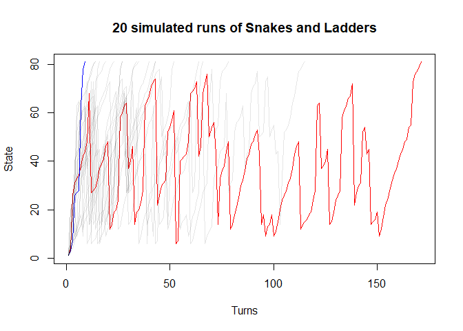
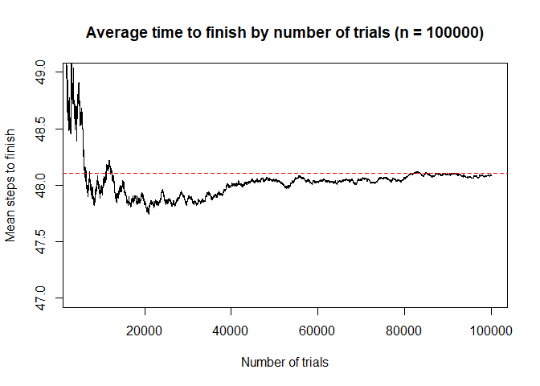

# Markov chains: Snakes and Ladders
Edwin Wang
2026-03-23

- [The Rules](#the-rules)
- [Representing the board](#representing-the-board)
- [Expected number of turns to
  finish](#expected-number-of-turns-to-finish)
- [Simulating games](#simulating-games)
- [Other visualisations](#other-visualisations)
  - [Heat map](#heat-map)
- [Resources](#resources)
- [Appendix](#appendix)
  - [Appendix A: Ladder and Snake
    positions](#appendix-a-ladder-and-snake-positions)

# The Rules

[Snakes and Ladders](https://en.wikipedia.org/wiki/Snakes_and_ladders)
is typically played with 2 players on an $n\times n$ grid. Each user
takes turns rolling a 6-sided dice, gradually progressing up the board
until they reach the final square. Along the way they can land on
‘snakes’, which takes them down to previous squares, or ‘ladders’, which
takes them up closer to the end.

We will look at the one player case with a few key differences:

1.  The player will start on ‘square 0’ outside the board, not on square
    1
2.  The player can overshoot the last square (e.g., if the player is 2
    away from the end, they can roll 2 or above to win)

# Representing the board

Using the board layout from Daykin et al. (1967), the probability of
going from state $i$ to state $j$ can be represented in a $101\times101$
transition matrix. While there are only 100 squares on the board, our
version requires an initial ‘zero’ state.

Let $p_{ij}$ be the probability of going from state $i$ to state $j$.
Then: $$P=
\begin{pmatrix}
p_{00} & p_{01} & p_{02} & \cdots & p_{0\ 100}\\
p_{10} & p_{11} & p_{12} & \cdots & p_{1\ 100}\\
\vdots & \vdots & \vdots & \ddots & \vdots\\
p_{100\ 0} & p_{100\ 1} & p_{100\ 2} & \cdots & p_{100\ 100}\\
\end{pmatrix}$$

Below are the first and last 5 rows of our matrix.

``` r
# size of board
n = 100

# number of sides of dice
d = 6

# first number is the 'entry' square, second number is 'exit' square
ladders = list(c(6,23),c(8,30),c(13,47),c(20,39),c(33,70),
               c(37,75),c(41,62),c(57,83),c(66,89),c(77,96))

snakes = list(c(27,10),c(55,16),c(61,14),c(69,50),c(79,5),
              c(81,44),c(87,31),c(91,25),c(95,49),c(97,59))

board = matrix(0,n,n)

# create simple board with no ladders
for (i in 1:n) {
  for (j in 0:min(n-i,d-1)) {
    board[i,j+i] = 1/d 
  } 
}

# add initial and absorbing state
board = board %>%  
  cbind(rep(0,n), .) %>% 
  rbind(c(rep(0,n),1))

# fill board with probabilities
board[,n+1][max(1,(n-(d-1))):n] = (max(1,1+d-n):d)/d

rownames(board) = 0:(n)
colnames(board) = 0:(n)

# vector of states to be deleted
delete = c()

# add in ladders
for (i in ladders) {
  for (j in (i[1]-(d-1)):i[1]) {
    board[j,][i[2]+1] = board[j,][i[2]+1] + 1/d
  }
  delete = c(delete, i[1])
}

# add in snakes
for (i in snakes) {
  for (j in (i[1]-(d-1)):i[1]) {
    board[j,][i[2]+1] = board[j,][i[2]+1] + 1/d
  }
  delete = c(delete, i[1])
}

board = board[-(delete+1),-(delete+1)]
knitr::kable(head(board)[,1:10], digits=3)
```

|     |   0 |     1 |     2 |     3 |     4 |     5 |     7 |     9 |    10 |    11 |
|:----|----:|------:|------:|------:|------:|------:|------:|------:|------:|------:|
| 0   |   0 | 0.167 | 0.167 | 0.167 | 0.167 | 0.167 | 0.000 | 0.000 | 0.000 | 0.000 |
| 1   |   0 | 0.000 | 0.167 | 0.167 | 0.167 | 0.167 | 0.167 | 0.000 | 0.000 | 0.000 |
| 2   |   0 | 0.000 | 0.000 | 0.167 | 0.167 | 0.167 | 0.167 | 0.000 | 0.000 | 0.000 |
| 3   |   0 | 0.000 | 0.000 | 0.000 | 0.167 | 0.167 | 0.167 | 0.167 | 0.000 | 0.000 |
| 4   |   0 | 0.000 | 0.000 | 0.000 | 0.000 | 0.167 | 0.167 | 0.167 | 0.167 | 0.000 |
| 5   |   0 | 0.000 | 0.000 | 0.000 | 0.000 | 0.000 | 0.167 | 0.167 | 0.167 | 0.167 |

``` r
knitr::kable(tail(board)[,71:81], digits=3)
```

|     |  86 |  88 |  89 |  90 |  92 |  93 |    94 |    96 |    98 |    99 |   100 |
|:----|----:|----:|----:|----:|----:|----:|------:|------:|------:|------:|------:|
| 93  |   0 |   0 |   0 |   0 |   0 |   0 | 0.167 | 0.167 | 0.167 | 0.167 | 0.000 |
| 94  |   0 |   0 |   0 |   0 |   0 |   0 | 0.000 | 0.167 | 0.167 | 0.167 | 0.167 |
| 96  |   0 |   0 |   0 |   0 |   0 |   0 | 0.000 | 0.000 | 0.167 | 0.167 | 0.500 |
| 98  |   0 |   0 |   0 |   0 |   0 |   0 | 0.000 | 0.000 | 0.000 | 0.167 | 0.833 |
| 99  |   0 |   0 |   0 |   0 |   0 |   0 | 0.000 | 0.000 | 0.000 | 0.000 | 1.000 |
| 100 |   0 |   0 |   0 |   0 |   0 |   0 | 0.000 | 0.000 | 0.000 | 0.000 | 1.000 |

Note that some states are missing. This is because each ladder/snake
reduces the number of possible states by one. Consider the snake
beginning from square 97 to square 59. Because landing on square 97
immediately drops the player down to square 59, both states are
equivalent reducing the total number of states by one. This holds true
for ladders.

Since there are a total of 20 snakes and ladders, this leaves us with a
final $81\times81$ transition matrix.

# Expected number of turns to finish

Since our chain constitutes an absorbing Markov chain, we have the
canonical form of a transition matrix: $$P=\begin{bmatrix}
Q & R\\
0 & I\\
\end{bmatrix}$$ From this, we can get the fundamental matrix, $N$ given
by: $$N=(I-Q)^{-1}$$ This represents the number of expected visits from
transient state $i$ to transient state $j$. To get the expected
absorbing time (or time to finish) $t$ , we multiply the fundamental
matrix by a column vector of 1s like so $t=N1$

``` r
# expected number of visits from transient state i to transient state j
fundamental = solve(diag(nrow(board)-1) - board[1:(nrow(board)-1),1:(nrow(board)-1)])

# expected number of steps to absorbing state from state i
ex_steps = fundamental %*% matrix(1,nrow(board)-1,1)


plot(ex_steps, xlab="State", ylab="Expected steps to win", main="Number of turns to win based on state")
```


``` r
head(ex_steps)
```

          [,1]
    0 48.10479
    1 47.97961
    2 47.19637
    3 47.30372
    4 47.37837
    5 47.42239

Therefore, on average, it would take around 48.1 turns to win. If we
were to start on square 1, it would take 47.98 turns to win and so on.

# Simulating games

Let us simulate a few games of Snakes and Ladders. I’ve highlighted the
shortest game blue and the longest game red.

``` r
# simulate discrete Markov chains according to transition matrix P
simulate.mc = function(tm) {
  
  # vector of states over time t
  states = c()

  # initialise variable for first state 
  states[1] = 1
  
  t = 1
  while (states[t] != nrow(tm)) {
    t = t + 1
    # probability vector to simulate next state X_{t+1}
    p = tm[states[t-1], ]
    
    # draw from multinomial and determine state
    states[t] <-  which(rmultinom(1, 1, p) == 1)
  }
  return(states)
}

games = list()
run_time = c()

# for reproducibility
set.seed(1984)

for (i in 1:20) {
  current_game = simulate.mc(board)
  
  # remove 1 to account for starting turn
  run_time = c(run_time, length(current_game)-1)
  games[[i]] = current_game
}

longest = which.max(run_time)
shortest = which.min(run_time)

plot(games[[longest]], type="l", col="red", xlab="Turns", ylab="State", main="20 simulated runs of Snakes and Ladders")
lines(games[[shortest]], col="blue")
for (i in 2:length(games)) {
  if (!(i == longest | i == shortest)) {
    lines(games[[i]], col=alpha("black",0.1))
  }
}
```



``` r
paste("Longest game:", run_time[longest], "turns")
```

    [1] "Longest game: 170 turns"

``` r
paste("Average game:", mean(run_time), "turns")
```

    [1] "Average game: 48.4 turns"

Will the simulated average converge to our calculated theoretical value?
According to the Law of Large numbers, repeating the simulation across a
large number of trials should make the mean converge to the true value
(indicated by the red dotted line).

``` r
trials = 100000

run_time = numeric(trials)
avg = numeric(trials)

for (i in 1:trials) {
  current_game = simulate.mc(board)
    
  # remove 1 to account for starting turn
  run_time[i] = length(current_game)-1
  avg[i] = mean(run_time[1:i])
}

plot(avg, type="l", ylim=c(47,49), xlim=c(5000,100000), xlab="Number of trials", ylab="Mean steps to finish", main="Average time to finish by number of trials (n = 100000)")
abline(h=ex_steps[1], lty=2, col="red")
```



``` r
paste("Longest game:", max(run_time), "turns")
```

    [1] "Longest game: 603 turns"

``` r
paste("Average game:", mean(run_time), "turns")
```

    [1] "Average game: 48.09021 turns"

# Other visualisations

## Heat map

We can visualise the expected number of visits to each state as a heat
map. Note, the bottom left tile represents square 1 and the top right
tile represents square 100, increasing from left to right (e.g., the
tile with coordinates (10,1) represents square 10, (1,2) represents
square 11, (2,2) square 12, etc…). I have also added back in the missing
squares for better interpretability.

``` r
ex_visits = data.frame(visits=fundamental[1,], pos=as.numeric(rownames(fundamental))) %>% 
  complete(pos = seq(min(pos), max(pos)))
ex_visits[1,1] = 100

for (i in ladders) {
  ex_visits[ex_visits$pos==i[1],]$visits = ex_visits[ex_visits$pos==i[2],]$visits
}

for (i in snakes) {
  ex_visits[ex_visits$pos==i[1],]$visits = ex_visits[ex_visits$pos==i[2],]$visits
}

ex_visits = ex_visits[order(ex_visits$pos),]
ex_visits$row = as.factor(rep(1:10,10))
ex_visits$col = as.factor(rep(1:10,each=10))

ggplot(ex_visits, aes(x=row,y=col,fill=visits)) +
  geom_tile() +
  geom_text(aes(label=round(visits,2)), color="white") +
  theme(axis.title = element_blank()) +
  labs(title = "Expected number of visits for each square",
       fill = "Visits")
```


``` r
#fundamental[1,]
```

We can see squares with either ladders or snakes on them have higher
number of average visits such as squares 16 (6,2) and 55 (5,6), and
squares 69 (9,7) and 50 (10,5).

# Resources

1.  Daykin, D. E., Jeacocke, J. E., & Neal, D. G. (1967). Markov Chains
    And Snakes And Ladders. The Mathematical Gazette, 51(378), 313–317.
    <https://doi.org/10.2307/3612943>

2.  Grinstead, C. M., & J Laurie Snell. (2006). Grinstead and Snell’s
    introduction to probability. Orange Grove Texts Plus.
    <https://math.dartmouth.edu/~prob/prob/prob.pdf>

3.  Bonakdarpour, M. (2006). Simulating Discrete Markov Chains: An
    Introduction. Stephens999.Github.io.
    <https://stephens999.github.io/fiveMinuteStats/simulating_discrete_chains_1.html>

# Appendix

## Appendix A: Ladder and Snake positions

Note: The first number indicates the entry point and the second number
the exit point

10 snakes: (27,10), (55,16), (61,14), (69,50), (79,5), (81,44), (87,31),
(91,25), (95,49), (97,59)

10 ladders: (6,23), (8,30), (13,47), (20,39), (33,70), (37,75), (41,62),
(57,83), (66,89), (77,96)
